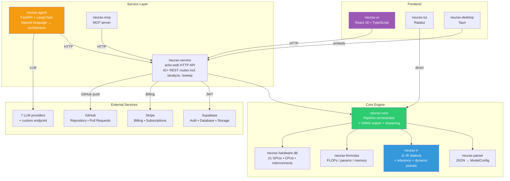
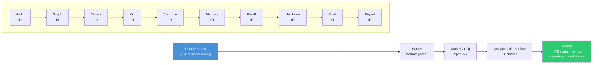
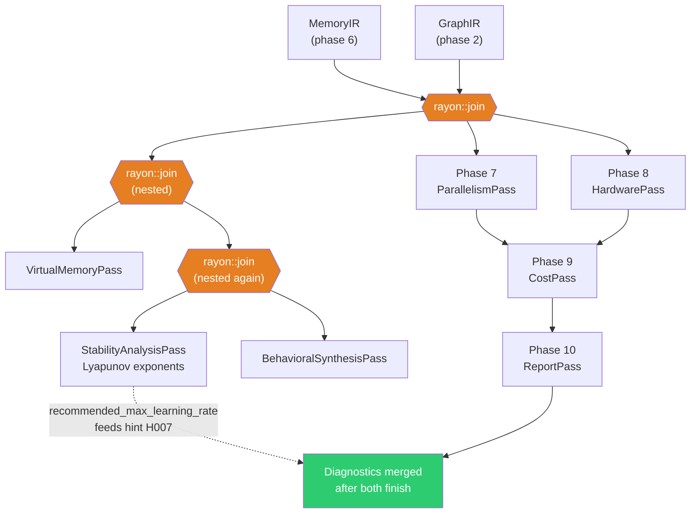
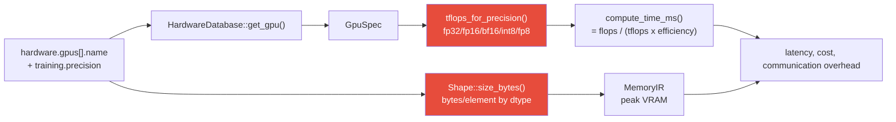
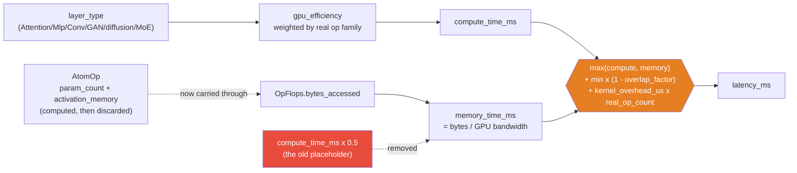
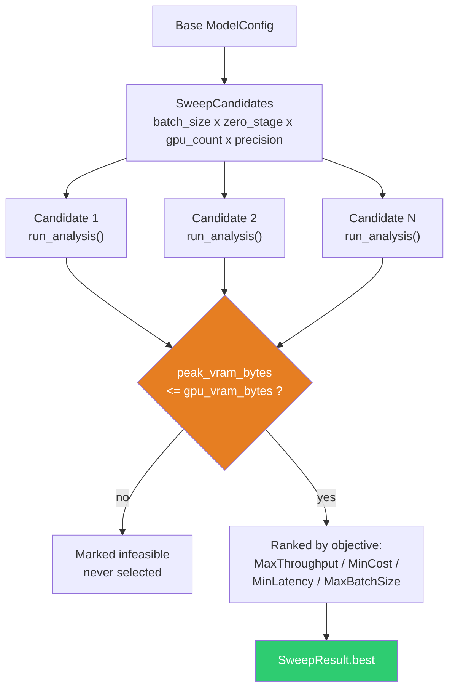

<p align="center"></p>

# NEURAX Architecture Design

This document describes the architecture, design principles, and data flow of the NEURAX compiler system — every crate, every pass, and how they actually communicate at runtime, verified against the real code rather than written from memory.

---

## Table of Contents

1. [Overview](#overview)
2. [System Architecture](#system-architecture)
3. [Data Flow](#data-flow)
   - [The 11-Phase IR Pipeline](#the-11-phase-ir-pipeline)
   - [Phases 7, 8 and 11 run concurrently](#phases-7-8-and-11-run-concurrently-not-in-numeric-order)
   - [Dynamic Analysis](#dynamic-analysis--the-three-concurrent-sub-passes)
4. [Cross-Pass Communication: `NeuraxContext`](#cross-pass-communication-neuraxcontext)
5. [Component Deep Dive](#component-deep-dive)
6. [Diagnostics](#diagnostics)
7. [Recommendations](#recommendations)
8. [Hyperparameter Sweep](#hyperparameter-sweep)
9. [Design Principles](#design-principles)
10. [Adding a New Model Family](#adding-a-new-model-family)

---

## Overview

NEURAX is an **environment to design, simulate, and optimize** neural network architectures — a visual canvas, an AI copilot, and the analytical engine described in this document, not a single tool. That engine is a real compiler in the traditional sense (parse → IR → passes → output), but unlike a compiler that emits machine code, it emits a complete **engineering report** of a model's behaviour on target hardware — cost, memory, speed, safety, and feasibility — **in milliseconds**, before a single GPU spins up.

The system is composed of:

| Component | Language | Port | Purpose |
|---|---|---|---|
| `neurax-service` | Rust (actix-web) | 9098 | HTTP API: analysis, export, billing, projects |
| `neurax-ui` | TypeScript (React 18) | 8081 | Visual web frontend |
| `neurax-agent` | Python (FastAPI) | 8099 | AI copilot for architecture design |
| `neurax-mcp` | Python | stdio | Model Context Protocol server |
| `neurax-tui` | Rust (Ratatui) | — | Terminal user interface |
| `neurax-desktop` | Rust (Tauri) | — | Desktop app — the compiler and UI, running locally, no account or network needed |

---

## System Architecture



*Figure 1 — the full studio, not just the compiler. Every arrow is a real, verified call path: the AI agent and the MCP server both reach the same `neurax-service` HTTP API the web UI uses, so none of the three entry points can see a different answer for the same design. `neurax-desktop` embeds this same API as a local process rather than talking to it over the network — no account, no upload, matching the desktop bundle's own stated promise.*

---

## Data Flow

The primary data flow for architecture analysis:



*Figure 2 — one JSON model description flows through eleven analytical phases and comes out the other side as a full engineering report. No phase here runs a tensor operation; every arrow is a pure function over the previous phase's output.*

### The 11-Phase IR Pipeline

Each phase transforms the representation and computes metrics. Phases 1-6 run strictly in sequence because each one's input is the previous one's output; phases 7, 8 and 11 do not depend on each other and run concurrently (see Figure 3 below); phases 9 and 10 need phase 7/8's output and so run after the join.

| Phase | IR Dialect | Input | Output | Key Metrics |
|---|---|---|---|---|
| 1 | ArchitectureIR | ModelConfig | ArchitectureIR | Layer count, model type, global params |
| 2 | GraphIR | ArchitectureIR | GraphIR | Graph topology, DAG validation, fan-in/fan-out |
| 3 | TensorIR | GraphIR | TensorIR | Tensor shapes, dimension resolution, memory layout |
| 4 | OperatorIR | TensorIR | OperatorIR | Operator types, FLOPs per operator, param count |
| 5 | ComputeIR | OperatorIR | ComputeIR | Total FLOPs, FLOPs breakdown, backward/optimizer overhead |
| 6 | MemoryIR | ComputeIR | MemoryIR | Peak VRAM, real (unsharded) and ZeRO-sharded parameter/gradient/optimizer bytes, fragmentation |
| 7 | ParallelismIR | MemoryIR + GraphIR | ParallelismIR | Tensor/pipeline/expert parallelism, ZeRO communication overhead, per-GPU compute time |
| 8 | HardwareIR | ComputeIR + MemoryIR | HardwareIR | GPU utilization, effective TFLOPS by precision, bandwidth, ridge point, latency |
| 11 | Dynamic (3 sub-passes) | GraphIR + MemoryIR + ModelConfig | DynamicResults | Memory-virtualization savings, Lyapunov-based stability + recommended max LR, behavioral synthesis |
| 9 | CostIR | HardwareIR + ParallelismIR | CostIR | Training cost USD, time hours, energy kWh, CO2 kg |
| 10 | ReportIR | All above + Dynamic's stability output | ReportIR | Consolidated report — a fixed set of scalar metrics per phase, plus per-layer breakdowns whose count scales with model depth (see note below) |

### Phases 7, 8 and 11 run concurrently, not in numeric order

The phase numbers above describe *what each one computes*, not the order they run in. Phase 8 (`HardwarePass`) declares `ParallelismIR` as part of its input tuple for pipeline-shape symmetry but never reads it — so it does not actually need to wait for phase 7. Phase 11 (Dynamic) only needs `GraphIR` and `MemoryIR`, neither of which comes from Cost or Report. `neurax-core` exploits exactly this to run all three concurrently on a `rayon` thread pool, with Dynamic's own three sub-passes further split into their own nested join:



*Figure 3 — before this session's pipeline audit, Dynamic analysis waited for Cost and Report to finish even though it reads neither, and `HardwarePass` ran a second time in full with an unread `ParallelismIR` swapped in. Both were removed: three independent branches now share one thread-pool join, and Report and Dynamic's stability output are merged only at the very end, since the H007 hint (learning rate vs. the Lipschitz-based stability bound) needs both.*

### Dynamic Analysis — the three concurrent sub-passes

| Pass | Focus | Output |
|---|---|---|
| VirtualMemoryPass | Memory fragmentation, virtualization savings | Allocation strategy, savings estimate |
| StabilityAnalysisPass | Training stability via per-layer Lyapunov exponents (real per-model sequence length, expert count, state dimension — not fixed per-type constants) | `network_lipschitz_estimate`, `recommended_max_learning_rate` (`2 / lipschitz`), stability index, risk level |
| BehavioralSynthesisPass | Runtime behavior inference (MoE imbalance, cache locality) | Behavioral metrics |

---

## Cross-Pass Communication: `NeuraxContext`

The pipeline above looks like a straight line of typed inputs and outputs, but a few metrics genuinely need to cross from one phase to a much later one without threading a new field through every struct in between — the clearest example is `total_flops`, computed in phase 5 (Compute) and needed again in phase 7 (Parallelism) to derive per-GPU compute time. `NeuraxContext` is a `Mutex<HashMap<String, f64>>` passed by reference to every pass for exactly this:

```rust
ctx.set_metric("total_flops", forward_flops);      // written by ComputePass
// ... several phases later ...
let total_flops = ctx.get_metric("total_flops");   // read by ParallelismPass
```

*Figure 4 — the shape of this channel is intentionally simple (string key, `f64` value, no schema), which is also its main risk: a producer that is never wired up fails silently rather than at compile time. This was a real, found-and-fixed bug this session — `ParallelismPass` read `total_flops` from a channel nothing had ever written to, computing every downstream compute-time and communication-overhead figure from zero. The fix was adding the one missing `ctx.set_metric()` call in `ComputePass`, not changing the channel's design — but it is the reason this document calls the mechanism out explicitly rather than leaving it implicit: any future producer/consumer pair added to it needs to be verified against a real model, the same way `neurax-core/examples/validate_hints.rs` verifies the rest of the pipeline.*

---

## Component Deep Dive

### neurax-parser

The parser ingests JSON model configurations conforming to the NEURAX universal schema (v1.0) and produces a strongly-typed `ModelConfig`.

**Key types**:
- `ModelConfig` — top-level configuration (model, training, hardware, parallelism)
- `ModelType` enum — Transformer, Cnn, Moe, Diffusion, Gnn, Rnn, Ssm, Gan, Hybrid, Multimodal, Snn, Experimental (verified against the real enum, `neurax-parser/src/model_config.rs`, rather than restated from an earlier, since-drifted list that named a nonexistent `RL` and `Custom` in place of the real `Hybrid` and `Experimental`)
- `LayerType` enum — Attention, Mlp, Embedding, Conv2d, etc.
- Schema validation via `ModelValidator`

**Parseable model types**: all 12 above — the schema accepts any of them so a design of that type parses and gets a report. Only 8 (transformer, cnn, moe, ssm, diffusion, gnn, gan, rnn) are exposed as a family choice in the canvas and have the compiler's own real, per-family formulas behind them end to end — the same 8 the neurax-ui section below states. `hybrid`, `multimodal`, `snn` and `experimental` still parse (useful for a hand-written or imported JSON that declares one) but aren't offered in the UI and fall back to generic layer-level formulas rather than a family-specific one.

### neurax-ir

The IR crate implements 11 dialect-like modules, each with its own `Pass` struct implementing the `IrPass` trait:

```rust
pub trait IrPass {
    type Input;
    type Output;
    type Metrics;

    fn build(&self, input: &Self::Input, ctx: &NeuraxContext) -> Result<Self::Output, NeuraxError>;
    fn compute_metrics(&self, output: &mut Self::Output, ctx: &NeuraxContext) -> Result<Self::Metrics, NeuraxError>;
    fn validate(&self, output: &Self::Output, metrics: &Self::Metrics) -> Result<(), NeuraxError>;
}
```

**Diagnostic system**: standardized codes with severity levels — see the [Diagnostics](#diagnostics) section below for the full, current list rather than a count duplicated here to drift out of sync with it.

### neurax-core

The orchestrator that wires together the 11-phase pipeline, dynamic analysis, and export. Also provides:
- `run_analysis()` — full pipeline entry point
- `analyze_json()` — JSON string → AnalysisResult
- `validate_json()` — JSON validation
- `get_model_summary()` — quick model summary
- ONNX export via `neurax-core/src/export/`

### neurax-formulas

Pure analytical formulas for ML operations. Hot path — maximum optimization.

**Modules**: attention, conv, mlp, embedding, normalization, moe, ssm, rnn, diffusion, gnn, custom, cnn_blocks.

### neurax-hardware-db

Built-in database with 21 GPUs, 2 CPUs, and 5 interconnect specifications.

**GPU specs include**: H200, GH200, H100-SXM, H100-PCIe, A100-SXM, A100-PCIe, L40S, L40, V100, RTX 4090, RTX 4080, RTX 3090, RTX 6000 Ada, RTX A5000, A10G, A30, T4, K80, **P100** — added specifically because it is one of only two accelerator choices on Kaggle Notebooks' free tier, alongside T4; without it, a Kaggle-P100 config silently fell back to a generic 20-TFLOPS profile.

**Key metrics per GPU**: TFLOPS (FP64/FP32/FP16/BF16/INT8/FP8), memory bandwidth, NVLink, TDP, L2 cache, SM count.

#### Precision handling — where it actually branches

The GPU a user selects, and the training precision they choose, both flow into the same two places, and both had a real gap fixed this session:



*Figure 5 — both `tflops_for_precision()` (compute speed) and `Shape::size_bytes()` (memory footprint) had a missing `"fp8"` match arm this session, silently falling back to the FP32 default: a model configured for fp8 computed `compute_time_ms` as if it ran at FP32 speed and sized every tensor as if it were 4 bytes/element instead of 1. None of the 16 reference models use fp8, so nothing had ever exercised the path. Fixed in both places; verified with a real before/after run (`compute_time_ms` dropped ~29.5x, consistent with real FP8-vs-FP32 throughput ratios).*

#### What actually reaches `latency_ms` — four real gaps closed, none of them touched by any test until this session

Every field HardwarePass reports (latency, throughput, GPU utilization,
bottleneck) had never once been checked against a real, published,
measured number — every existing test asserted only that a value was
positive and finite. Testing against real hardware benchmarks surfaced
four concrete gaps in the compute chain itself, not just missing tests:



*Figure 6 — (1) memory time was a flat `compute_time_ms * 0.5`, unrelated to how many bytes an operation actually moves — two models with identical FLOPs but very different weight footprints reported identical memory time. Fixed by carrying each op's real bytes through from the operator pass, previously computed and discarded. (2) The "Industrial Roofline" model's own `overlap_factor` and `kernel_launch_overhead_us` were built and never read — latency assumed 100% overlap between compute and memory (no real GPU achieves that) and zero cost per kernel launch. (3) Convolution-family layers (Conv, GAN's Generator/DiscriminatorBlock, diffusion's U-Net blocks, MoE's experts) fell outside the attention/mlp efficiency weighting and ran at the "nothing recognized" 100%-efficiency fallback — checked against NVIDIA's own published ResNet-50 inference throughput, NEURAX predicted ~7.2x too fast before a real, calibrated `conv_efficiency` term was added. (4) `gpu_utilization` could exceed 100% on any multi-GPU config (an 8-GPU model reported 486%) because its numerator used pre-division compute time against a per-GPU-divided `latency_ms`.*

Three real published references now exist where none did before —
`neurax-core/tests/published_hardware_scaling.rs`,
`published_cnn_inference_throughput.rs`, and
`published_energy_accounting.rs` — each checking a predicted number
against a real, cited, measured one, rather than only that it is
positive and finite. Narayanan et al. 2021's own Megatron-LM data
doubles as the reference for both a large-scale multi-GPU degradation
curve and a small, commonly-configured scale; Luccioni et al. 2023's
BLOOM carbon-footprint report grounds the cost pass's energy formula
against a real measured training run.

### neurax-service

Production actix-web HTTP server with:
- 42+ REST routes (analysis, sweep, inference, export, projects, billing, credits, compliance, API keys, agent control, presets, hardware, plugin)
- Supabase JWT authentication + API key authentication with scope-based authorization
- Stripe billing integration
- SSE streaming for real-time analysis
- CORS, gzip compression
- Health checks

### neurax-agent

Python/FastAPI/LangChain AI copilot with a 3-phase declarative pipeline:
1. **Planning** — LLM generates a complete ArchSpec (nodes + edges) using structured output
2. **Validation** — Pure Python topology validator checks DAG, fan-in, connectivity
3. **Materialization** — Stream tool calls to the canvas with auto-correction (up to 3 retries)

Has planning templates for 11 families (verified: `FAMILY_TEMPLATES` in `arch_planner.py` has exactly 11 keys: `cnn`, `transformer`, `moe`, `ssm`, `rnn`, `gnn`, `gan`, `diffusion`, `snn`, `multimodal`, `experimental`), with a catalogue (`catalogue.json`) of 170 blocks plus 23 macro-blocks — counted directly from the JSON rather than restated from an earlier, since-drifted figure. This is not the same count as the compiler's own 8 fully-supported families below, and the two should not be read as contradicting each other: 8 of these 11 keys (all but `snn`, `multimodal`, `experimental`) map to a family the compiler backs with real, verified formulas; the other 3 are generic prompts the agent falls back to for a family it can still *draw* but that has no dedicated formula module of its own yet.

### neurax-ui

React 18 + TypeScript + Vite single-page application with:
- Visual canvas (React Flow) with drag-and-drop, parameter editing, minimap
- 64 reference templates across the 8 architecture families the compiler fully supports
- Metrics dashboard with dozens of scalar metrics (count depends on what a design has, not one fixed number — see Diagnostics note below) plus charts
- AI Chat Drawer with SSE streaming
- Hyperparameter Optimization panel
- Time Machine cost/carbon projection
- Inference Intelligence panel
- Project management (cloud CRUD)
- Credits system with plan-based limits
- Export panel (ONNX, JSON, Network Graph)
- GitHub export with PR creation

### neurax-mcp

Model Context Protocol server that exposes NEURAX capabilities to MCP-compatible clients (e.g., Claude Desktop). It is a thin proxy — every tool call ends in an HTTP request to `neurax-service`, the same backend the web UI talks to, so an MCP client can never see a different answer than the UI would for the same design.

| Tool | Purpose |
|---|---|
| `analyze_architecture` | Full NEURAX analysis: FLOPs, memory, latency, cost estimates |
| `check_budget` | Analyze against a stated hard constraint ("must fit in 1 MB", "under 20 ms") — pass/fail per constraint with headroom |
| `find_optimal_hyperparameters` | The hyperparameter sweep (see below), exposed as a tool |
| `get_hardware_list` | List all GPU configurations in `neurax-hardware-db` |
| `get_presets` / `get_preset` | List / fetch a specific architecture template from the catalogue |
| `estimate_training_cost` | Training cost for a given configuration |
| `get_compliance_config` | Regulatory metadata (EU AI Act, CSRD, etc.) |
| `get_credits` / `get_user_info` | Account state for the current user |
| `health_check` | Is the NEURAX backend reachable |

---

## Diagnostics

Every analysis can attach diagnostics to the report — not a separate linter bolted on afterward, but codes emitted by the same passes that compute the metrics they describe. Each has a severity and a stable code, so a caller (the UI, the agent, an API consumer) can filter or react to a specific one without parsing prose.

| Severity | Codes | Examples |
|---|---|---|
| **Error** (`E`) | E001–E005 | OOM risk, shape-inference gate blocked, custom formula failed, unsupported layer, cycle in graph |
| **Warning** (`W`) | W001–W007 | Custom layer with no formula, unresolved symbolic dimensions, ZeRO stage not recommended, Flash Attention not enabled, memory close to the GPU limit, inefficient parallelism split, cross-layer shape mismatch |
| **Info** (`I`) | I001–I003 | GQA detected, MoE detected, Flash Attention detected — architectural facts about the design, not problems |
| **Hint** (`H`) | H001–H008 | Enable gradient checkpointing / Flash Attention, consider INT8, increase pipeline-parallel micro-batches, ZeRO-3 recommended, no LR warmup configured, learning rate exceeds the Lipschitz-based stability bound, tokens-per-parameter ratio far from Chinchilla-optimal |

H006, H007 and H008 are the most recent additions and are the ones that reach across phases: H007 needs phase 11's `recommended_max_learning_rate` (see Figure 3), and H008 needs both the real parameter count (phase 1) and a user-declared dataset size. All three, plus I001 (GQA) and I002 (MoE), were validated against all 16 reference models by independently recomputing each one's firing condition from the raw input JSON rather than trusting the compiler's own report — `neurax-core/examples/validate_hints.rs` — with the result checked into the repository (80 checks, 0 false positives, 0 false negatives) rather than asserted in this document from memory.

### A note on "how many metrics" — there is no single honest number

At different points the project has stated 43, 66, 35, 70+ and 77 metrics in five different places (a since-deleted MLIR backend's doc comment, this book, two comments in the same source file, and a test file) — five different answers to what sounds like one simple question. Counting a real report's JSON output directly (`gpt3_175b.json`, via `to_json()`) resolves why: it has 168 leaf fields, but a large share of them are **per-layer breakdowns** (`structure.params_per_layer.layer_3`, `performance.latency_per_layer.mlp_7`, ...) whose count scales with the model's own depth — a 96-layer model produces far more JSON keys than a 10-layer one for the exact same set of *kinds* of information. "How many metrics" is really two different, both-true answers: a **fixed** ~76 scalar fields across the 9 static phases (`neurax-core/tests/metrics_count.rs`, manually tallied, not by struct reflection), plus the 3 Dynamic sub-passes' own structs (`VirtualMemoryMetrics` + `StabilityMetrics` + `BehavioralMetrics`, 33 fields combined as of this writing), plus a **variable** number of per-layer entries. Stating one flat number without that distinction is exactly how five different, individually-defensible counts ended up contradicting each other — this document states the breakdown instead of adding a sixth number to the pile.

---

## Recommendations

Separate from diagnostics (which describe a problem) are recommendations
(`generate_recommendations`, `neurax-ir/src/report/pass.rs`) — a small,
fixed set of rule-triggered suggestions, each carrying a stated *impact*.
Until recently, every impact was a hardcoded string unrelated to the model
actually analyzed: a 4-layer model and a 96-layer one got the identical
"save 70%" gradient-checkpointing estimate, and a model already running on
the fastest available GPU could be told to expect a "2-3x speedup" from
switching to one. All four now compute a real, model-specific number:

| Trigger | Recommendation | What it now computes |
|---|---|---|
| Peak VRAM > 80% of GPU capacity | Enable Gradient Checkpointing | `1 - 1/sqrt(num_layers)` of activation memory freed (Chen et al. 2016, *Training Deep Nets with Sublinear Memory Cost*) — a 16-layer model and a 96-layer one now get genuinely different figures (75% vs. 90%), not the same flat constant |
| `optimal_gpu_count > 1` and `data_parallel_efficiency < 0.8` | Use Hybrid Parallelism | A target efficiency computed from *this* model's own current efficiency, `current + (1 - current) * 0.90` — the recovery fraction grounded in Narayanan et al. 2021's real measured PTD-P-vs-ZeRO-3 comparison, so the reported target can never be below where the model already stands |
| `bottleneck == "memory-bound"` | Consider Higher Bandwidth GPU | The real bandwidth ratio to whichever GPU the hardware database actually reports as fastest (not a hardcoded "H100 SXM") — stays silent if the model is already on that GPU |
| `training_cost_usd > $10,000` | Optimize Training Duration | A dollar figure — the run's own `training_cost_usd` times a cited, conservative spot-instance discount (60%, the low end of the commonly documented 60-90% AWS/GCP GPU spot range) — rather than a bare, unquantified percentage |

The discount/recovery *rates* themselves are still constants (a spot
discount is a market fact, not something derivable from a model's
architecture) — what changed is that every recommendation now multiplies
its rate by a real number that comes out of the model being analyzed,
instead of stating the rate alone as if it were the whole answer.

---

## Hyperparameter Sweep

Given a base configuration, `sweep_hyperparameters` (in `neurax-core`) runs a grid search over `batch_size x zero_stage x gpu_count x precision` — each point a full, real call to `run_analysis()`, not an approximation of one:



*Figure 7 — nothing here is simulated: every candidate is the exact same 11-phase pipeline described above, run once per point in the grid. This is also why it stays cheap: the pipeline itself runs in low single-digit milliseconds, so even a few dozen candidates finish well under the time a single real OOM-and-retry cycle on actual hardware would cost.*

Exposed as `POST /sweep` on `neurax-service`, and as the `find_optimal_hyperparameters` MCP tool above — both call the same function, so the AI agent, the MCP client, and a direct API caller are all bounded by the same feasibility check.

---

## Design Principles

1. **Analytical, not empirical** — All metrics are computed via pure analytical formulas. No GPU is needed, no simulation is run. Results are deterministic and available in milliseconds.

2. **Compiler-inspired pipeline** — The system follows the traditional compiler architecture: parse → IR → optimize → generate. Each pass is independent and composable.

3. **Multi-language ecosystem** — Rust for performance-critical analysis, Python for the AI agent, TypeScript for the web UI. Each language is chosen for its strengths.

4. **Schema-first design** — The JSON model config schema (v1.0) is the universal interchange format. All components read from and write to this schema.

5. **Deterministic by default** — The core analysis pipeline is fully deterministic. The AI agent uses LLMs but validates every output before materialization.

6. **Extensible catalogues** — Model families, blocks, and constraints are defined in JSON catalogues that can be extended without code changes.

7. **Observability-first** — Every analysis includes phase timing, diagnostics, and recommendations. The system explains not just what the metrics are, but why.

---

## Adding a New Model Family

To add a new model family to NEURAX:

### 1. Add to the Rust parser

In `neurax-parser/src/model_config.rs`, add the new family to `ModelType::from_str()`:

```rust
"my_family" => Ok(Self::MyFamily),
```

Add the corresponding serialization:

```rust
Self::MyFamily => "my_family",
```

### 2. Add formulas

In `neurax-formulas/src/`, create a new module (e.g., `my_family.rs`) with FLOPs, parameter, and memory formulas. Register it in `lib.rs`.

### 3. Add catalogue entries

In `neurax-agent/catalogue.json`, add blocks for the new family. Each block should include `type`, `name`, `family`, `params`, `description`, and `max_inputs`.

### 4. Add template

In `neurax-ui/src/data/modelTemplates.ts`, add reference templates for the new family.

### 5. Add constraints

In `neurax-agent/block_constraints.json`, add fan-in limits for the new family's blocks.

### 6. Add to arch_planner

In `neurax-agent/arch_planner.py`, add a family template in `FAMILY_TEMPLATES` describing the typical flow for the new family.