# Le compilateur NEURAX — document de référence

> Ce document décrit l'intégralité du compilateur NEURAX : chaque crate, chaque
> phase, chaque étape, son rôle, son but et sa position dans la chaîne.
>
> Il est écrit à partir du code et nomme le fichier qui porte chaque affirmation.
> Les chiffres viennent d'inspections directes ou d'appels au service en cours
> d'exécution — l'exemple de bout en bout du §2.2 est une analyse réelle, pas une
> illustration.

---

## Table des matières

1. [Ce qu'est NEURAX, et ce qu'il n'est pas](#1-ce-quest-neurax-et-ce-quil-nest-pas)
2. [Vue d'ensemble](#2-vue-densemble)
3. [Carte du dépôt : les huit crates](#3-carte-du-dépôt--les-huit-crates)
4. [Les portes d'entrée](#4-les-portes-dentrée)
5. [Étape 0 — la compilation côté client](#5-étape-0--la-compilation-côté-client)
6. [Étape 1 — le parseur](#6-étape-1--le-parseur)
7. [Le contrat de passe](#7-le-contrat-de-passe)
8. [Les onze phases du pipeline](#8-les-onze-phases-du-pipeline)
9. [Les crates de calcul](#9-les-crates-de-calcul)
10. [Le système dynamique](#10-le-système-dynamique)
11. [Précision et confiance](#11-précision-et-confiance)
12. [Sorties et exports](#12-sorties-et-exports)
13. [Au-delà d'une analyse](#13-au-delà-dune-analyse)
14. [Le service HTTP](#14-le-service-http)
15. [Le système agentique](#15-le-système-agentique)
16. [Les couches de vérification](#16-les-couches-de-vérification)
17. [Limites connues](#17-limites-connues)

*Annexes* — [A · le chemin complet](#annexe-a--le-chemin-complet-dun-bout-à-lautre) ·
[B · glossaire](#annexe-b--glossaire) ·
[C · inventaire des modules](#annexe-c--inventaire-des-modules)

---

## 1. Ce qu'est NEURAX, et ce qu'il n'est pas

NEURAX est un **compilateur analytique d'architectures neuronales**. Il prend la
description d'un modèle et rend, en quelques millisecondes et sans GPU, ce que ce
modèle coûterait : nombre de paramètres, FLOPs, VRAM au pic, latence, durée et
prix d'entraînement, empreinte carbone, risques de comportement à l'inférence.

**Il n'exécute jamais un modèle.** C'est écrit noir sur blanc dans le code :
`neurax-core/src/sweep.rs` — *« NEURAX never runs a model »*. Il n'existe aucun
poids dans le système, à aucun moment.

Trois conséquences structurelles :

| Conséquence | Détail |
|---|---|
| **Aucune génération de code** | Pas de lowering, pas de LLVM, pas de kernel. Le seul crate qui faisait du vrai lowering (`neurax-mlir`) a été supprimé : rien ne l'utilisait et il ne compilait plus. |
| **La précision est un facteur, pas une opération** | Choisir int4 divise une largeur en octets dans les formules mémoire. Aucun tenseur n'est converti. |
| **La spécification est empirique** | « Un VAE de Stable Diffusion pèse 34 M de paramètres » n'est pas un théorème : c'est une mesure, vérifiée contre des tailles publiées. |

Ce que le compilateur produit est donc une **prédiction**, pas une exécution — et
c'est exactement la promesse : savoir si ça tient avant d'engager des heures de GPU.

### Les huit familles

NEURAX supporte exactement huit familles d'architecture, et cet ensemble est
identique dans cinq sources indépendantes (`neurax-parser`'s `ModelType`,
`plugins.ts`, `catalogue.json`, `presets.rs`, et les fixtures de test) — un test
lit les cinq et échoue si l'une s'écarte.

```
transformer · cnn · moe · diffusion · gnn · rnn · ssm · gan
```

---

## 2. Vue d'ensemble

Le chemin complet, d'un dessin sur un canevas à un rapport chiffré.

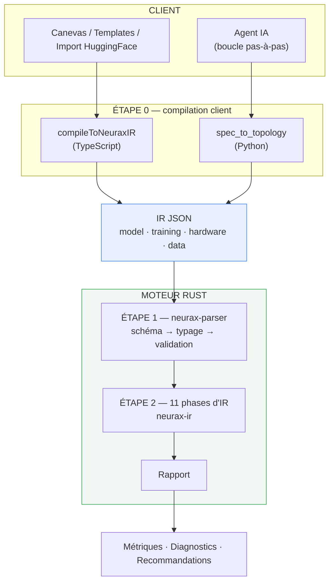

Le point charnière est le **document IR JSON**. C'est le seul contrat entre
l'extérieur et le moteur, et tout ce qui entre dans NEURAX prend cette forme,
qu'il vienne du studio, de l'agent, d'un import ou d'un appel HTTP direct.

### 2.1 Le contrat : le document IR

Quatre sections, et un numéro de version de schéma.

```json
{
  "schema_version": "1.0",

  "model": {
    "name": "GPT2-Small",
    "type": "transformer",
    "global_params": {
      "hidden_size": 768, "num_layers": 12, "vocab_size": 50257,
      "sequence_length": 1024, "num_heads": 12
    },
    "layers": [
      { "id": "emb",  "layer_type": "embedding",     "params": { "vocab_size": 50257, "hidden_size": 768 } },
      { "id": "attn", "layer_type": "attention",     "params": { "hidden_size": 768, "num_heads": 12 } },
      { "id": "mlp",  "layer_type": "mlp",           "params": { "hidden_size": 768, "intermediate_size": 3072 } },
      { "id": "ln",   "layer_type": "normalization", "params": { "hidden_size": 768 } }
    ],
    "connections": [
      { "from": "emb",  "to": "attn" },
      { "from": "attn", "to": "mlp"  },
      { "from": "mlp",  "to": "ln"   }
    ]
  },

  "training": { "batch_size": 8, "precision": "bf16", "optimizer": "adamw" },
  "hardware": { "gpus": [ { "name": "A100-80GB", "count": 1 } ] },
  "data":     { "dtype": "bf16", "dataset_size": 10000000000 }
}
```

| Section | Ce qu'elle porte | Qui la lit |
|---|---|---|
| `model` | La structure : type de famille, paramètres globaux, couches, arêtes. | Phases 1 à 4 |
| `training` | Le régime : taille de batch, précision, optimiseur. | Phases 5, 6, 9 |
| `hardware` | La cible : GPU nommés et leur nombre. | Phases 7, 8, 9 |
| `data` | Le jeu de données : dtype, taille, dimensions d'image le cas échéant. | Phases 3, 9 |

Trois remarques sur ce contrat :

- **`layer_type` est une chaîne, pas une énumération.** Le parseur la résout vers
  l'une des 61 variantes via 176 alias acceptés. Ce choix rend le document
  tolérant aux conventions de nommage externes — mais il désarme aussi le
  filtrage exhaustif du compilateur, ce qui a déjà coûté des bugs (§17).
- **`global_params` est un fourre-tout aplati.** Il transporte aussi bien des
  dimensions que des réglages d'entraînement, sans schéma. Une valeur absente y
  déclenche le défaut de la formule qui la lit ; une valeur **présente à zéro**
  l'écrase — d'où la règle « une taille non positive vaut absente », appliquée des
  deux côtés (§5.1 et §9.2).
- **`schema_version`** est transporté jusque dans les métadonnées du rapport, ce
  qui permet à un consommateur de savoir sous quelle version un résultat archivé
  a été produit.

### 2.2 Un exemple de bout en bout

Le document ci-dessus, envoyé à `POST /analyze` sur un service en cours
d'exécution, donne :

```json
{
  "metadata": {
    "generated_at": "2026-09-08T08:00:38Z",
    "neurax_version": "0.15.0",
    "model_name": "GPT2-Small",
    "model_type": "transformer",
    "schema_version": "1.0",
    "analysis_time_ms": 0
  },
  "metrics": {
    "total_parameters":       123633408,
    "total_flops":            1710552514560.0,
    "parameter_memory_bytes": 247266816,
    "activation_memory_bytes":465567744,
    "optimizer_state_bytes":  494533632,
    "peak_vram_bytes":        1454635008,
    "effective_tflops":       130.26,
    "latency_ms":             13.13,
    "training_time_hours":    4.45,
    "training_cost_usd":      13.36,
    "energy_kwh":             2.14,
    "co2_kg":                 0.50
  },
  "diagnostics":      [ { "severity": "Hint", "code": "H008", "category": "Configuration", "message": "…" } ],
  "recommendations":  [],
  "warnings":         [],
  "confidence_score": 1.0,
  "phase_timeline":   [ { "name": "Architecture", "duration_ms": 0, "status": "completed" }, … ]
}
```

**123 633 408 paramètres.** GPT-2 Small est publié à 124 millions : l'écart est de
0,3 %. C'est le genre de vérification que le §16 systématise.

Le reste se lit ensemble : le modèle pèse 247 Mo en bf16, ses activations 466 Mo,
les états d'AdamW 495 Mo — soit **1,45 Go de VRAM au pic**, très loin des 80 Go de
la carte visée. Il tiendrait donc, et l'entraînement sur 10 milliards de tokens
prendrait environ 4,5 heures pour 13 dollars, 2,1 kWh et 0,5 kg de CO₂.

### 2.3 Le budget de temps

La promesse « sous les 50 ms » n'est pas un slogan : chaque phase est chronométrée
et le rapport transporte sa propre chronologie.


Sur l'exemple ci-dessus, les huit phases séquentielles se mesurent chacune à
**0 ms** — la résolution du chronomètre est la milliseconde, et une analyse de
cette taille passe sous cette résolution en entier. C'est ce qui rend le balayage
du §13.1 possible : sonder des milliers de configurations coûte ce que coûterait
une seule exécution ailleurs.

Le champ `analysis_time_ms` des métadonnées porte le total.

---

## 3. Carte du dépôt : les huit crates

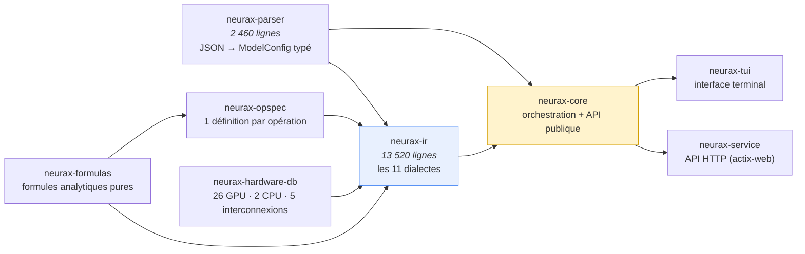

| Crate | Rôle | Position |
|---|---|---|
| **neurax-parser** | Désérialise le JSON, le type (`ModelType`, `LayerType`), le valide. 61 variantes de couches, 176 chaînes acceptées avec leurs alias. | Porte d'entrée du moteur |
| **neurax-ir** | Le cœur. Onze dialectes, chacun une passe : architecture, graphe, tenseurs, opérateurs, calcul, mémoire, parallélisme, matériel, coût, rapport, dynamique. | Moteur |
| **neurax-formulas** | Les formules analytiques pures, par famille d'opération : attention, conv, mlp, embedding, normalisation, moe, ssm, rnn, diffusion, gnn, lora, cnn_blocks, activation, custom. Chemin chaud. | Bibliothèque de calcul |
| **neurax-opspec** | **Une** définition par opération — paramètres, FLOPs, mémoire d'activation — au lieu de trois dispersées. 22 types migrés. | Registre d'opérations |
| **neurax-hardware-db** | Spécifications matérielles réelles, dans trois modules — `gpu.rs`, `cpu.rs`, `interconnect.rs` : 26 GPU servis, 2 CPU, 5 interconnexions. TFLOPS par précision, bande passante, NVLink, TDP, cache L2, nombre de SM. | Base de données |
| **neurax-core** | Orchestre les passes, expose `run_analysis` / `analyze_json`, le sweep, le streaming, l'export ONNX, les newtypes d'unités. | Chef d'orchestre |
| **neurax-service** | L'API HTTP : analyse, sweep, presets, projets, partages, facturation, mémoire d'agent. | Frontière réseau |
| **neurax-tui** | Interface terminal sur le même moteur : sélection de modèle, affichage des métriques, comparaison au réel. Voir [§14.3](#143-le-client-terminal--neurax-tui). | Client |

Deux crates Rust sont **hors du workspace** et ne sont pas construits par la CI :
`neurax-desktop` (il lie la webview de la plateforme, et embarque
`neurax_service::configure_routes` dans son propre processus plutôt que de lancer
un second binaire) et `neurax-ir-poc`.

Deux composants non-Rust complètent l'ensemble :

| Composant | Rôle |
|---|---|
| **neurax-ui** (TypeScript / React) | Le studio : canevas, palette de 444 blocs sur 8 familles, 106 templates de référence, et son propre compilateur client `compileToNeuraxIR`. |
| **neurax-agent** (Python / FastAPI) | La boucle agentique pas-à-pas, et son propre compilateur client `spec_to_topology`. Voir [§15](#15-le-système-agentique). |
| **neurax-mcp** (Python) | Un serveur Model Context Protocol qui expose 11 opérations de lecture et d'analyse à des clients externes (Claude Desktop, etc.) : `analyze_architecture`, `check_budget`, `find_optimal_hyperparameters`, `estimate_training_cost`, `get_hardware_list`, `get_presets`, `get_preset`, `get_compliance_config`, `get_credits`, `get_user_info`, `health_check`. Il appelle `neurax-service` en HTTP, exactement comme l'agent. |

---

## 4. Les portes d'entrée

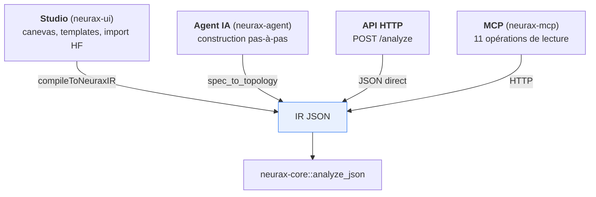

Toutes convergent sur le même document. C'est ce qui garantit qu'un design
analysé depuis le canevas et le même design analysé par l'agent donnent la même
réponse — **à condition que les deux compilateurs clients soient d'accord**, ce
qui n'a pas toujours été le cas (voir §17).

---

## 5. Étape 0 — la compilation côté client

Avant d'atteindre Rust, un dessin doit devenir un document IR. Deux
implémentations font ce travail.

### 5.1 Côté studio — `neuraxCompiler.ts`

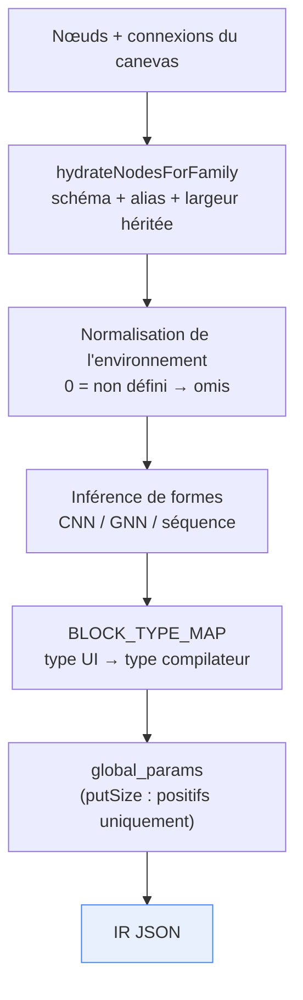

Quatre responsabilités, dans cet ordre :

1. **Hydratation** — un template dit `hidden_size`, le schéma du bloc dit
   `d_model` ; sans normalisation la valeur du template resterait à côté du
   défaut au lieu de le remplacer. La largeur du modèle est héritée par les
   blocs qui n'en déclarent pas.
2. **Normalisation de l'environnement** — `HardwareConfig` utilise `0` comme
   sentinelle « non défini pour cette famille ». Toute grandeur de taille non
   strictement positive est ramenée à `null` **une fois**, à l'entrée, pour que
   chaque `??` en aval retombe correctement sur son défaut.
3. **Inférence de formes** — propagation à travers le graphe, avec l'arithmétique
   propre à chaque famille (conv/pool pour les familles image, dimensions de
   graphe pour GNN, `[batch, seq, hidden]` pour les séquences).
4. **Traduction des types** — `BLOCK_TYPE_MAP` fait passer des 444 types de la
   palette aux types que le compilateur lit ; ce qui n'est pas mappé devient
   `Opaque` (repli silencieux mais volontaire).

Les nœuds `input` et `output` sont **écartés** : ce sont des déclarations de
forme, pas des couches à poids.

### 5.2 Côté agent — `budget_check.spec_to_topology`

Même travail, en Python, en amont d'une vérification de budget. Il applique
`LAYER_TYPE_MAP` (les noms du catalogue de l'agent vers ceux du compilateur),
écarte les types de forme via `SHAPE_ONLY_TYPES` en **pontant le graphe** —
chaque prédécesseur relié à chaque successeur — et ne transmet que des paramètres
globaux réellement renseignés (`if value:`, ce qui rejette naturellement les
zéros).

---

## 6. Étape 1 — le parseur

`neurax-parser` transforme un texte JSON en une structure typée, ou refuse.

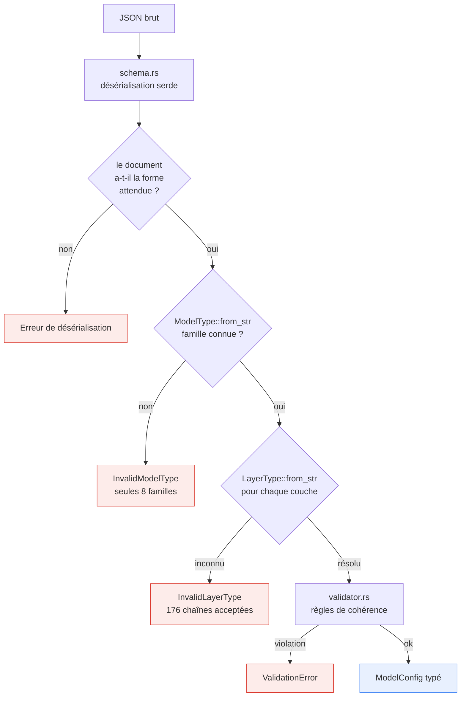

| Fichier | Rôle |
|---|---|
| `schema.rs` | Les structures serde : `model`, `training`, `hardware`, `data`, `global_params`, `layers`, `connections`. |
| `model_config.rs` | Le typage. `ModelType::from_str` n'accepte que les huit familles et leurs alias (`convolutional`→cnn, `mamba`→ssm…). `LayerType::from_str` accepte 176 chaînes vers 61 variantes. |
| `validator.rs` | Les règles de cohérence sur le document lui-même. |
| `error.rs` | `ParserError` — dont `Invalid model type: '{0}'`, la porte qui refuse une famille hors des huit. |

**C'est ici que se joue la frontière du système**, et elle est stricte : chacune
des quatre portes ci-dessus rejette le document entier. Un seul type de couche
inconnu, et l'analyse échoue en `400` — il n'y a pas de dégradation partielle.

C'est ce qui rend le repli `Opaque` du compilateur client si important (§5.1) :
sans lui, un bloc exotique quelque part sur le canevas ferait tomber tout le
rapport plutôt que de simplement rester non chiffré. Les deux mécanismes sont les
deux moitiés d'une même décision de conception — le moteur est intransigeant, le
client absorbe.

---

## 7. Le contrat de passe

Toutes les phases obéissent au même trait, `neurax-ir/src/traits.rs` :

```rust
pub trait IrPass: Send + Sync {
    type Input;  type Output;  type Metrics;  type PassError;

    fn build(&self, input: &Self::Input, ctx: &NeuraxContext) -> Result<Self::Output, Self::PassError>;
    fn compute_metrics(&self, output: &mut Self::Output, ctx: &NeuraxContext) -> Result<Self::Metrics, Self::PassError>;
    fn validate(&self, output: &Self::Output, metrics: &Self::Metrics) -> Result<(), Self::PassError>;
}
```

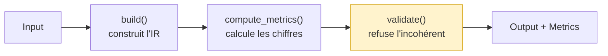

Trois temps séparés, toujours dans cet ordre : **construire**, puis **mesurer**,
puis **vérifier**. `validate()` est ce qui fait qu'une phase peut refuser son
propre résultat — c'est par exemple `Compute IR error: Total FLOPs is zero` qui
rejette un rapport dont le total serait nul.

Un canal latéral, le `MetricsStore` de `neurax-core/src/engine.rs`, transporte
des scalaires nommés entre passes (`Arc<Mutex<HashMap<String, f64>>>`). Sa
simplicité est aussi son risque : un producteur jamais branché échoue en silence
plutôt qu'à la compilation.

---

## 8. Les onze phases du pipeline

`neurax-core::run_analysis` les enchaîne. Trois d'entre elles sont indépendantes
et tournent **en parallèle** via `rayon::join`.

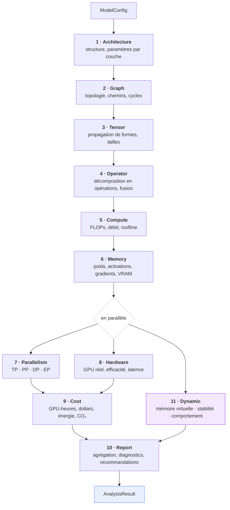

> Le parallélisme n'est pas cosmétique : Parallelism et Hardware n'ont besoin que
> de Memory + Graph + Compute, et Dynamic ne lit ni le matériel, ni le coût, ni le
> rapport. `HardwarePass::build()` reçoit bien un `ParallelismIR` dans son tuple
> d'entrée mais **ne le lit jamais** — la place existe pour la symétrie du
> pipeline, pas pour une dépendance réelle.

### Phase 1 · Architecture

**Rôle** — le premier dialecte. Il lit `ModelConfig` et produit la structure du
modèle : la liste des couches, leurs paramètres résolus, et le **compte de
paramètres par couche**.

**Position** — première, parce que tout le reste en dépend : les FLOPs sont
calculés à partir des dimensions qu'elle résout, la mémoire à partir des
paramètres qu'elle compte.

**Point clé** — `repeat_scale_for` : une couche que le client déclare répétée N
fois (un `layer_stack` compact, un bloc JSON valant pour N) est comptée N fois,
et ce facteur se propage jusqu'aux intervalles de vie des tenseurs.

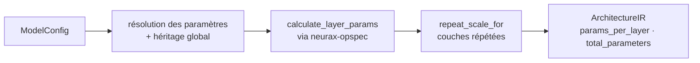

### Phase 2 · Graph

**Rôle** — le graphe de calcul : nœuds, arêtes, ordre topologique, détection de
cycles, chemins de l'entrée vers la sortie.

**Position** — après Architecture (il lui faut les couches), avant Tensor (la
propagation de formes suit le graphe).

**Point clé** — `calculate_tensor_size` y vit aussi, et il utilise déjà la table
unique `neurax_formulas::dtype_bytes`.

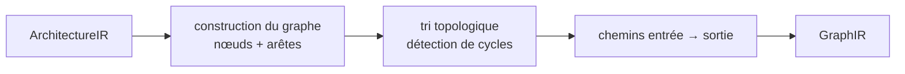

### Phase 3 · Tensor

**Rôle** — la propagation de formes. Chaque tenseur du graphe reçoit sa forme
réelle et sa taille en octets.

**Position** — après Graph, parce que la propagation suit les arêtes.

**Point clé** — `shape_inference.rs` fait une inférence **par famille** :
arithmétique conv/pool pour les familles image, dimensions de graphe pour GNN,
enfilage de la dimension cachée pour les séquences. La taille en octets passe par
`Shape::size_bytes`, qui délègue à `dtype_bytes` — une seule table de largeurs
dans tout le projet.

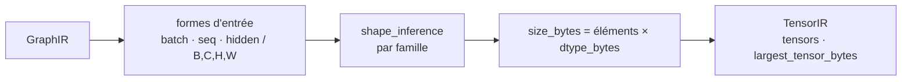

### Phase 4 · Operator

**Rôle** — décomposer chaque couche en opérations atomiques (GEMM, softmax,
normalisation, élément-par-élément…) et détecter les **fusions** possibles.

**Position** — après Tensor : une opération a besoin des formes de ses tenseurs
pour être chiffrée.

**Point clé** — `decompose_layer_to_ops` interroge d'abord `neurax-opspec` ; un
type migré y trouve sa formule et sort immédiatement. `fusion.rs` détecte les
enchaînements fusionnables, ce qui change le nombre de lancements de kernel et
donc la latence.

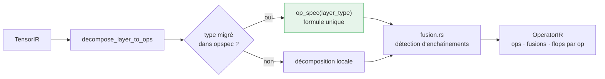

### Phase 5 · Compute

**Rôle** — le calcul analytique : FLOPs avant et arrière, FLOPs par token, débit,
position sur le roofline (borné par le calcul ou par la mémoire), TFLOPS
effectifs.

**Position** — après Operator, qui lui fournit les opérations chiffrables.

**Point clé** — c'est la phase qui refuse un total nul. `backward_flops_multiplier`
(≈ 2× l'avant) et `optimizer_flops_multiplier` viennent de `neurax-formulas`.

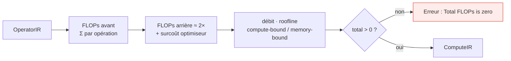

### Phase 6 · Memory

**Rôle** — la simulation mémoire complète : poids, activations, gradients, états
d'optimiseur, fragmentation, VRAM au pic, risque d'OOM.

**Position** — après Compute. C'est la phase la plus dense du pipeline et celle
qui porte la promesse produit (« est-ce que ça tient ? »).

**Points clés**

- **Poids** = `total_parameters × dtype_bytes(precision)`.
- **Activations** = la somme des intervalles de vie (`liveness.rs`), et non un
  pic simultané : l'entraînement garde vivantes toutes les activations avant
  d'exécuter la passe arrière. Un pic simultané sous-estimerait d'un ordre de
  grandeur.
- **Gradient checkpointing** réduit cette somme à ≈ √L couches conservées.
- **MoE** applique un facteur ≈ 1,5 (routage vers les experts).
- **Parallélisme tensoriel** divise les activations par le degré TP.
- **Fragmentation** est modélisée séparément (`fragmentation.rs`).

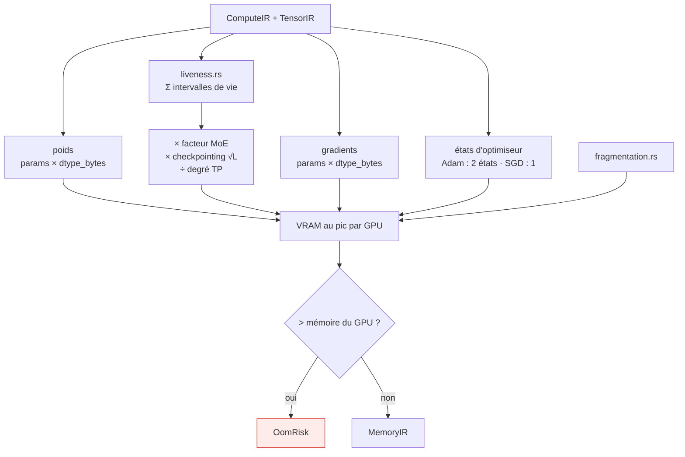

### Phase 7 · Parallelism

**Rôle** — l'analyse de scalabilité : parallélisme tensoriel (TP), pipeline (PP),
données (DP), experts (EP) ; surcoût de communication, bulles de pipeline,
nombre optimal de GPU.

**Position** — en parallèle de Hardware et Dynamic ; ne dépend que de Memory et
Graph.

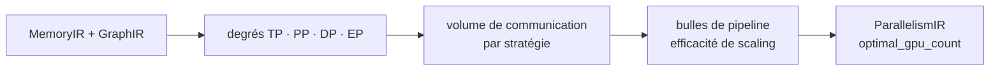

### Phase 8 · Hardware

**Rôle** — projeter le modèle sur du matériel réel. Il interroge
`neurax-hardware-db` pour le GPU nommé et applique une **calibration** de son
efficacité.

**Position** — en parallèle de Parallelism ; ne dépend que de Compute et Memory.

**Point clé** — `calibration.rs` porte des facteurs d'efficacité par GPU : les
TFLOPS de la fiche technique ne sont jamais atteints, et le rapport le reflète
(`effective_tflops` face à `gpu_tflops_fp16`).

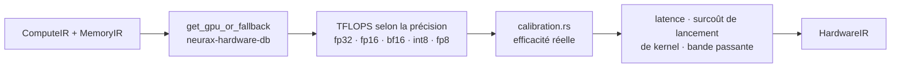

### Phase 9 · Cost

**Rôle** — le dialecte économique : GPU-heures, prix, énergie consommée,
équivalent CO₂.

**Position** — après Parallelism et Hardware, dont il consomme les résultats.

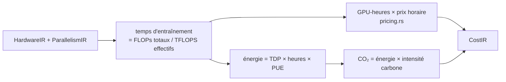

### Phase 10 · Report

**Rôle** — agréger les dix dialectes en un rapport unique, produire les
diagnostics, les recommandations et la chronologie des phases.

**Position** — dernière. Elle consomme tout.

**Point clé** — `ReportPass` reçoit un `ReportInput` qui référence les neuf IR
précédents. C'est aussi le point d'entrée du **Time Machine** et de la
sérialisation JSON.

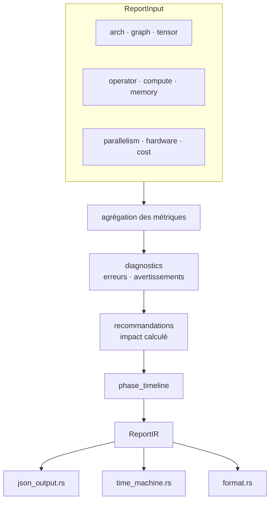

### Phase 11 · Dynamic

Détaillée en [§10](#10-le-système-dynamique).

---

## 9. Les crates de calcul

### 9.1 `neurax-formulas` — les formules pures

Quatorze modules, un par famille d'opération, sur le chemin chaud du compilateur.

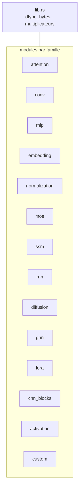

`dtype_bytes` est **la** table des largeurs de stockage du projet :

| dtype | octets/paramètre |
|---|---|
| fp64 | 8 |
| fp32 | 4 |
| fp16, bf16 | 2 |
| fp8, int8 | 1 |
| **int4** | **0,5** — deux valeurs empaquetées par octet (GPTQ/AWQ/QLoRA-NF4/GGUF Q4) |

Le type de retour est `f64` précisément pour qu'int4 soit exprimable. C'est
pourquoi il ne doit exister **aucune seconde table** : une copie en entiers avait
divergé et faisait rapporter des activations int4 plus grosses qu'en int8.

### 9.2 `neurax-opspec` — une définition par opération

Avant ce crate, le même `LayerType` était dispatché trois fois dans trois
fichiers distincts de `neurax-ir`, sans que rien ne force l'accord :
`architecture/mod.rs` (paramètres), `operator/pass.rs` (FLOPs),
`tensor/shape_inference.rs` (formes). Chaque bug réel trouvé lors de l'audit du
1–2 septembre 2026 avait la même forme : un côté corrigé, l'autre non.

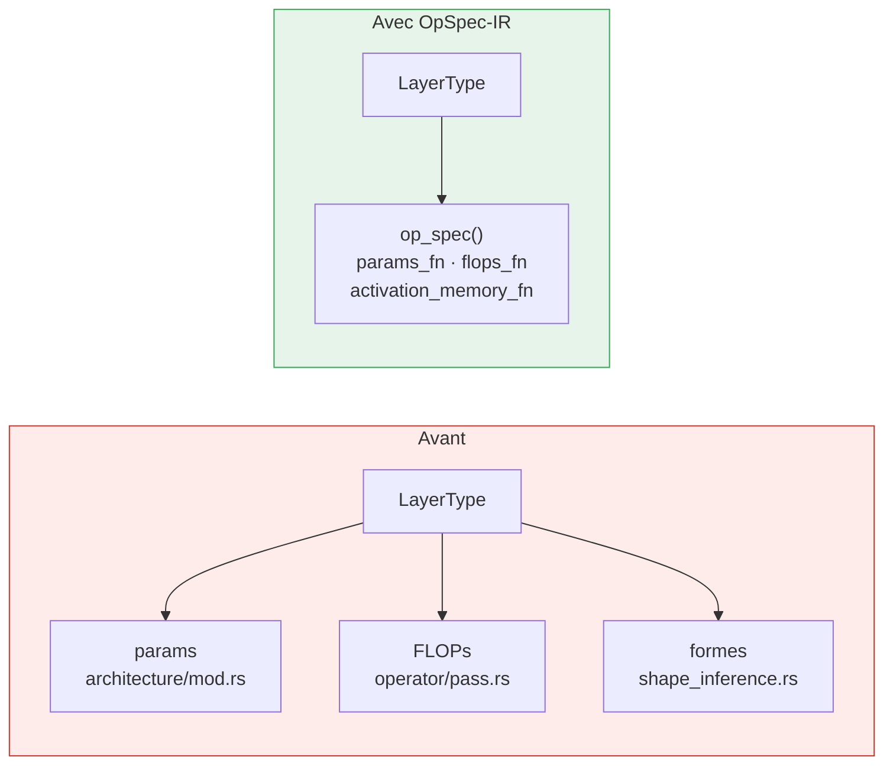

Tout tient dans `registry.rs`, qui porte à la fois la table `spec(LayerType, params_fn, flops_fn)` et les fonctions qu'elle référence.

**22 types** y sont migrés. Un type enregistré est servi par une seule
définition ; `operator/pass.rs` l'interroge en premier et sort immédiatement si
elle existe.

`extra_usize` y lit les paramètres globaux, et **traite une valeur non positive
comme absente** : un zéro envoyé par un client est une sentinelle « non défini »,
pas une donnée, et le laisser passer annulait la formule qui le lisait.

### 9.3 `neurax-hardware-db` — le matériel réel

26 GPU servis, avec par pièce : TFLOPS par précision (FP64/FP32/FP16/BF16/INT8/FP8),
bande passante mémoire, capacité, NVLink, TDP, cache L2, nombre de SM. Plus des
CPU et des interconnexions.

Les sources sont les fiches techniques officielles des fabricants, recoupées avec
une seconde source indépendante par famille quand le PDF n'est pas lisible par
machine — c'est écrit dans `add_builtin_gpus`.

```mermaid
flowchart TB
    q["Nom de GPU<br/>venant de training.hardware"] --> look["get_gpu(name)"]
    look --> found{"connu ?"}
    found -->|oui| spec["GpuSpec"]
    found -->|non| fb["get_gpu_or_fallback<br/>profil générique"]
    fb --> spec
    spec --> s1["TFLOPS par précision<br/>fp64 · fp32 · fp16 · bf16 · int8 · fp8"]
    spec --> s2["bande passante · capacité<br/>NVLink · TDP · cache L2 · SM"]
    s1 --> use["Phase 8 · Hardware"]
    s2 --> use
    ic[("interconnect.rs<br/>5 liens")] --> par["Phase 7 · Parallelism"]
    cpu[("cpu.rs<br/>2 processeurs")] --> use

    style fb fill:#fff3cd,stroke:#d39e00
```

`get_gpu_or_fallback` garantit qu'un nom inconnu ne fait pas tomber l'analyse :
le rapport sort avec un profil générique plutôt qu'avec une erreur. C'est un
choix assumé — mais il rend un GPU mal orthographié invisible dans le résultat.

---

## 10. Le système dynamique

Trois sous-passes qui étendent le pipeline statique avec des capacités
prédictives. Elles tournent **en parallèle** entre elles et du reste.

```mermaid
flowchart TB
    src["MemoryIR · GraphIR · ComputeIR"] --> fork{"en parallèle"}
    fork --> vm["<b>VirtualMemoryPass</b><br/>débordement, pagination,<br/>stratégies d'offload"]
    fork --> st["<b>StabilityAnalysisPass</b><br/>stabilité numérique<br/>selon la précision"]
    fork --> bs["<b>BehavioralSynthesisPass</b><br/>comportement à l'inférence"]
    vm --> dr["DynamicResults"]
    st --> dr
    bs --> dr

    style fork fill:#fff,stroke:#999,stroke-dasharray: 3 3
    style dr fill:#f3e8fd,stroke:#9334e6
```

| Sous-passe | Rôle |
|---|---|
| **VirtualMemory** (`virtual_memory.rs`) | Que se passe-t-il quand le modèle dépasse la VRAM : pagination, offload CPU, coût de la stratégie. |
| **StabilityAnalysis** | Risque numérique en fonction de la précision choisie et de la structure du graphe. |
| **BehavioralSynthesis** | Comportement prédit à l'inférence, à partir du profil de calcul. |

Un quatrième module, `evaluation.rs`, n'est pas une passe : c'est la suite de validation du système dynamique, qui vérifie les trois autres contre les objectifs qu'elles se donnent.

Le **dialecte Inference** (`neurax-ir/src/inference/`) est distinct : il simule le
comportement d'inférence à la demande (endpoint `/inference/simulate`), avec un
score de stabilité qui applique une pénalité forfaitaire par niveau de
quantification (int4 −0,30 · int8 −0,15 · bf16 −0,02). C'est une heuristique de
cadrage, pas une mesure de qualité.

---

## 11. Précision et confiance

Deux notions différentes qu'il ne faut pas confondre.

**La précision numérique** (`fp32`…`int4`) est un choix de conception du modèle.
Elle est **obligatoire** (`MANDATORY_FIELDS.common`, aux côtés de `hardware` et
`batchSize`), se règle dans le panneau de cible de simulation, et se ramifie en
deux endroits : `dtype_bytes` pour toute la mémoire, et `quantization_level` pour
la pénalité de stabilité à l'inférence.

**La confiance dans le résultat** (`neurax-ir/src/precision/`) est autre chose :
un système à quatre niveaux qui score chaque métrique indépendamment selon ses
facteurs de dégradation.

```mermaid
flowchart LR
    subgraph num["Précision numérique — choix de conception"]
        p1["fp32 · fp16 · bf16 · int8 · int4"] --> p2["dtype_bytes<br/>→ toute la mémoire"]
        p1 --> p3["quantization_level<br/>→ pénalité de stabilité"]
    end
    subgraph conf["Confiance — qualité de la prédiction"]
        c1["confidence.rs<br/>score par métrique"] --> c2["4 niveaux<br/>approximatif → exact"]
        c3["backward.rs<br/>ratios passe arrière"] --> c1
    end
```

---

## 12. Sorties et exports

```mermaid
flowchart TB
    r["ReportIR"] --> j["to_json()<br/>JsonOutput"]
    r --> f["format.rs<br/>rapport lisible"]
    r --> t["time_machine.rs<br/>projection pluriannuelle"]
    a["ArchitectureIR"] --> o["export/onnx.rs<br/>ModelProto protobuf"]

    j --> j1["168 champs feuilles<br/>dont des ventilations par couche"]
    o --> o1["graphe et formes réels<br/><b>tenseurs à zéro</b>"]

    style o1 fill:#fff3cd,stroke:#d39e00
```

### 12.1 Comment lire un rapport

Un rapport a sept clés de premier niveau. Les connaître, c'est savoir où chercher.

```mermaid
flowchart TB
    rep["Rapport"] --> md["<b>metadata</b><br/>version · modèle · horodatage<br/>analysis_time_ms"]
    rep --> me["<b>metrics</b><br/>57 scalaires + 4 ventilations"]
    rep --> di["<b>diagnostics</b><br/>ce qui ne va pas, et pourquoi"]
    rep --> re["<b>recommendations</b><br/>quoi faire, et ce que ça rapporte"]
    rep --> wa["<b>warnings</b><br/>corrections automatiques appliquées"]
    rep --> cs["<b>confidence_score</b><br/>fiabilité de la prédiction"]
    rep --> pt["<b>phase_timeline</b><br/>durée par phase"]

    me --> b1["params_per_layer"]
    me --> b2["flops_per_layer"]
    me --> b3["latency_per_layer"]
    me --> b4["ops_distribution"]

    style di fill:#fdecea,stroke:#d93025
    style re fill:#e6f4ea,stroke:#34a853
```

Les métriques les plus consultées, groupées par question :

| Question | Champs |
|---|---|
| **Quelle taille ?** | `total_parameters` · `parameter_memory_bytes` · `params_per_layer` |
| **Combien de calcul ?** | `total_flops` · `forward_flops` · `backward_flops` · `flops_per_token` · `flops_per_layer` |
| **Est-ce que ça tient ?** | `peak_vram_bytes` · `activation_memory_bytes` · `optimizer_state_bytes` · `gradient_memory_bytes` · `memory_fragmentation_pct` |
| **À quelle vitesse ?** | `latency_ms` · `effective_tflops` · `gpu_tflops_fp16` · `latency_per_layer` |
| **Combien ça coûte ?** | `training_time_hours` · `training_cost_usd` · `energy_kwh` · `co2_kg` |

Le rapprochement d'`effective_tflops` et de `gpu_tflops_fp16` est instructif : le
premier est ce que le modèle atteint réellement, le second la fiche technique du
GPU. Leur rapport est le rendement du design sur cette carte.

### 12.2 Diagnostics — ce qui ne va pas

Chaque diagnostic porte une **sévérité**, une **catégorie**, un **code stable** et
un message qui explique la cause plutôt que de la constater.

```mermaid
flowchart LR
    an["Analyse"] --> d{"sévérité"}
    d -->|Critical| c["Le design ne peut pas fonctionner<br/>E001 · OOM"]
    d -->|Warning| w["Le design fonctionne mais dérive"]
    d -->|Hint| h["Le design est défendable,<br/>mais discutable<br/>H001 · H008"]

    style c fill:#fdecea,stroke:#d93025
    style h fill:#e8f0fe,stroke:#4285f4
```

Deux exemples réels, produits par un design volontairement démesuré (un 175 B en
fp32 visant une T4) :

```
[Critical · E001 · MemoryOverflow]
  This model needs 3414.9 GB but the target GPU has 17.2 GB — 198.8x over.
  It will not start.

[Hint · H001 · MemoryOverflow]
  Optimizer state is 41% of memory (1396.6 GB) — more than the weights.

[Hint · H008 · Configuration]
  Tokens-per-parameter ratio is 1.7 (3.00e11 tokens / 1.75e11 params); the
  compute-optimal ratio from Chinchilla scaling laws (Hoffmann et al. 2022)
  is ~20.
```

Le troisième mérite d'être souligné : le diagnostic ne dit pas seulement que le
rapport est bas, il cite la loi d'échelle qui fonde le seuil. C'est la différence
entre un avertissement et un conseil.

Les catégories observées à ce jour : `MemoryOverflow`, `Configuration`.

### 12.3 Recommandations — quoi faire, et ce que ça rapporte

Une recommandation n'est pas un conseil générique : son champ `impact` est
**calculé sur le design analysé**.

```json
{
  "category": "MemoryOptimization",
  "title": "Enable Gradient Checkpointing",
  "description": "Reduce activation memory by recomputing during backward pass",
  "impact": "Save ~558.2 GB VRAM (~90% of activation memory…)"
}
```

« ~558,2 Go » n'est pas une fourchette de brochure : c'est 90 % des activations
*de ce modèle-là*, sur *cette configuration-là*. Un test dédié
(`recommendation_impact_is_computed.rs`) existe précisément pour empêcher qu'une
recommandation reparte vers un texte fixe.

### 12.4 Warnings et score de confiance

`warnings` recense les **corrections automatiques** que le compilateur a
appliquées à l'entrée pour pouvoir l'analyser — par exemple `Hardware auto-fixed
to "RTX4090" (was "CPU")`. Elles ne signalent pas un problème du design, mais un
écart entre ce que le client a envoyé et ce qui a réellement été mesuré : les
ignorer, c'est lire un rapport sur un modèle légèrement différent de celui qu'on
croit.

`confidence_score` résume la fiabilité de la prédiction, alimenté par le système
de confiance du §11.

---

**Sur le nombre de métriques** — la question « combien de métriques ? » a reçu
cinq réponses différentes dans l'histoire du projet parce qu'elle en cache deux :
un ensemble **fixe** d'environ 76 champs scalaires sur les neuf phases statiques,
plus les trois structures des sous-passes dynamiques (33 champs), plus un nombre
**variable** de ventilations par couche qui grandit avec la profondeur du modèle.
Un rapport GPT-3 175B produit 168 champs feuilles ; un modèle de 10 couches, bien
moins, pour exactement la même information.

**Sur l'export ONNX** — il produit un `ModelProto` valide, avec le graphe et les
formes réels, mais ses tenseurs sont **remplis de zéros**
(`raw_data: vec![0u8; …]`). Il sert à inspecter une topologie, pas à inférer. La
génération de code PyTorch (côté studio) est la sortie réellement exécutable.

---

## 13. Au-delà d'une analyse

### 13.1 Sweep — `neurax-core/src/sweep.rs`

Puisqu'une analyse complète coûte de l'ordre de la milliseconde, balayer des
milliers de configurations est bon marché d'une façon qu'un entraînement réel ne
sera jamais. Le sweep réutilise `run_analysis` comme évaluateur en boîte noire.

```mermaid
flowchart TB
    base["ModelConfig de base"] --> gen["Produit cartésien des candidats<br/>batch_size × zero_stage<br/>× gpu_count × precision"]
    gen --> next["Candidat suivant"]
    next --> run["run_analysis<br/>pipeline complet, ~0-1 ms"]
    run --> fit{"tient en VRAM ?"}
    fit -->|non| skip["écarté"]
    fit -->|oui| score["score selon l'objectif<br/>max_throughput · min_cost<br/>min_latency · max_batch_size"]
    skip --> more
    score --> more{"reste-t-il<br/>des candidats ?"}
    more -->|oui| next
    more -->|non| best["Meilleure configuration"]

    style run fill:#e8f0fe,stroke:#4285f4
    style best fill:#e6f4ea,stroke:#34a853
```

Un champ laissé à un seul élément fige l'hyperparamètre correspondant à la valeur
de la configuration de base — le balayage est donc aussi étroit ou large qu'on le
veut.

Il fait varier des paramètres de **déploiement**. Il ne touche jamais à
l'architecture : ni largeur, ni profondeur, ni têtes. NEURAX ne redimensionne pas
un modèle ; il chiffre celui qu'on lui donne.

### 13.2 Analyse asynchrone et streaming

Une analyse peut être lancée en tâche de fond et suivie par identifiant de job.
`neurax-core/src/streaming.rs` émet les événements au fil des phases ; le service
les expose en trois temps.

```mermaid
sequenceDiagram
    participant C as Client
    participant S as neurax-service
    participant E as neurax-core

    C->>S: POST /analyze/stream
    S->>S: crée job_id · state.jobs
    S-->>C: job_id
    S->>E: run_analysis (tâche de fond)
    E-->>S: événements de phase (streaming.rs)

    loop tant que le job tourne
        C->>S: GET /analyze/status/:job_id
        S-->>C: phase courante · progression
    end

    E-->>S: AnalysisResult
    S->>S: state.results[job_id]
    C->>S: GET /analyze/result/:job_id
    S-->>C: rapport complet
```

Les entrées `state.jobs` et `state.results` sont balayées après expiration : sans
cela, chaque analyse en streaming laissait derrière elle un rapport JSON complet
pour toute la durée de vie du processus — ce qu'un service de longue durée, ou une
application de bureau laissée ouverte plusieurs jours, accumule sans borne.

### 13.3 Le reste de `neurax-core`

| Module | Rôle |
|---|---|
| `lib.rs` | `run_analysis` — l'enchaînement des onze phases — et `AnalysisResult` avec ses sérialisations (`to_json`, `to_json_bytes`, `save_json`). |
| `engine.rs` | `IrPasserEngine` : le chronométrage par passe (`PassTiming`, `EngineStats`) et le `MetricsStore`, canal latéral partagé entre passes. |
| `runner.rs` | Les commodités d'appel : analyse depuis une chaîne JSON (`analyze_json`) ou depuis un fichier. |
| `units.rs` | Des newtypes qui empêchent de confondre des grandeurs physiques : `FLOPs`, `Bytes`, `ParamCount`, `LatencyMs`, `TokensPerSec`. Le compilateur Rust garantit qu'on n'additionne pas des FLOPs et des octets. |
| `sweep.rs` | Le balayage de configurations, §13.1. |
| `streaming.rs` | L'émission d'événements, ci-dessus. |
| `export/onnx.rs` | La sérialisation protobuf ONNX, §12. |

### 13.4 Comparaison et Time Machine

`/analyze/compare` met deux designs côte à côte avec l'écart en pourcentage par
métrique — comparer une valeur obtenue sous une précision avec une valeur obtenue
sous une autre n'est pas faux, mais répond à une question différente, et le
module le signale plutôt que de mélanger.

`time_machine.rs` projette le design dans le temps.

```mermaid
flowchart LR
    r["ReportIR<br/>coût · énergie · CO₂"] --> t1["projection pluriannuelle<br/>coût · carbone · scaling"]
    t1 --> t2["seuils réglementaires datés<br/>EU AI Act · CSRD"]
    t2 --> t3{"le modèle franchit<br/>un seuil ?"}
    t3 -->|oui| ob["obligations déclenchées<br/>avec leur date"]
    t3 -->|non| ok["sous les seuils"]

    style ob fill:#fff3cd,stroke:#d39e00
```

Ce n'est pas une liste générique : les seuils sont vérifiés contre des textes
réglementaires réels et datés.

---

## 14. Le service HTTP

`neurax-service` (actix-web) expose le moteur.

```mermaid
flowchart TB
    subgraph an["Analyse"]
        e1["POST /analyze"]
        e2["POST /sweep"]
        e3["POST /analyze/compare"]
        e4["POST /analyze/stream<br/>+ /analyze/result/:id + /analyze/status/:id"]
        e5["POST /timemachine"]
        e6["POST /inference/simulate"]
    end
    subgraph cat["Catalogue"]
        e7["GET /hardware"]
        e8["GET /presets · /presets/:id"]
        e9["POST /plugin/validate"]
        e10["GET /compliance/config"]
    end
    subgraph pers["Persistance"]
        e11["/projects (CRUD)"]
        e12["/shares (+ /download)"]
    end
    subgraph exp["Export"]
        e13["POST /export/onnx"]
        e14["POST /export/github"]
    end
    subgraph ag["Agent"]
        e15["/memory/core · /memory/archival · /memory/conversation"]
        e16["/agent/* (clé API à portée agent)"]
    end
    subgraph com["Compte"]
        e17["/me · /credits · /api-keys"]
        e18["/billing/* · /stripe/webhook"]
    end
```

Deux remarques de position :

- Les endpoints `/memory/*` sont **à la racine**, pas sous `/agent/*`, parce que
  `neurax-agent` ne possède aucune clé de service à présenter.
- Les huit endpoints `/agent/*` n'ont **aucun client** dans le dépôt : ils
  exigent une clé à portée `agent` que rien ne détient.

### 14.1 Persistance — `persistence.rs`

`AppState` garde les projets dans une `DashMap` : sans persistance, chaque projet
enregistré disparaissait à l'arrêt du processus. Sur le service hébergé c'est
survivable — c'est un processus parmi plusieurs — mais l'application de bureau
*est* le produit, et le module lit les projets depuis le disque au démarrage puis
les réécrit à chaque changement.

```mermaid
flowchart LR
    start["Démarrage"] --> load["persistence::attach<br/>lecture depuis le disque"]
    load --> mem["AppState · DashMap"]
    mem --> api["/projects (CRUD)"]
    api --> save["écriture à chaque changement"]
    save --> disk[("projects_path")]
    disk -.-> load
```

Le même appel sert le service autonome et l'application de bureau, pour que les
deux ne puissent pas diverger sur la façon de charger, sauvegarder ou récupérer.

### 14.2 Mémoire d'agent — `agent_memory.rs`

Trois tables Supabase, portées par `project_id` seul. Le choix est délibéré et
documenté : `neurax-ui` n'a aucune intégration d'authentification Supabase réelle,
donc une table indexée par `user_id` serait de la mémoire que rien ne pourrait
relire correctement. `project_id` est réel — `Index.tsx` le suit déjà comme état
vivant.

```mermaid
flowchart TB
    a["neurax-agent"] --> core["/memory/core<br/>préférences durables"]
    a --> arch["/memory/archival<br/>rationnel des designs passés"]
    a --> conv["/memory/conversation<br/>continuité des échanges"]
    core --> db[("Supabase<br/>agent_core_memory<br/>agent_archival_memory<br/>agent_conversation_log")]
    arch --> db
    conv --> db

    style db fill:#f3e8fd,stroke:#9334e6
```

La recherche archivistique est un filtrage par mots-clés (`ilike` via PostgREST),
pas une recherche sémantique : c'est le repli assumé pour une instance Supabase
sans `pgvector`.

### 14.3 Le client terminal — `neurax-tui`

Une interface terminal complète sur le même moteur, sans passer par le service.

```mermaid
flowchart LR
    ms["model_selector.rs<br/>modèles JSON embarqués"] --> app["app.rs<br/>état de l'application"]
    app --> core["neurax-core::run_analysis"]
    core --> md["metrics_display.rs<br/>rendu des métriques"]
    core --> cmp["comparison.rs<br/>calculé vs réel"]
    rw["real_world_data.rs<br/>mesures publiées"] --> cmp
    md --> ui["ui.rs<br/>rendu ratatui"]
    cmp --> ui
```

| Module | Rôle |
|---|---|
| `main.rs` | Point d'entrée du binaire. |
| `app.rs` | L'état de l'application et sa logique. |
| `model_selector.rs` | Le choix du modèle, avec des définitions JSON embarquées dans le binaire. |
| `metrics_display.rs` | Les composants d'affichage des métriques. |
| `comparison.rs` | La vue de comparaison entre le calculé et le réel. |
| `real_world_data.rs` | Les mesures publiées servant de référence à cette comparaison. |
| `ui.rs` | Le rendu. |

C'est aussi le chemin le plus court pour vérifier le moteur à la main : il appelle
`run_analysis` directement, sans HTTP ni sérialisation intermédiaire.

---

## 15. Le système agentique

`neurax-agent` (Python, FastAPI) est un client du compilateur, pas une partie de
celui-ci — mais il en est le principal consommateur automatisé.

```mermaid
flowchart TB
    req["POST /runs"] --> loop

    subgraph loop["Boucle LangGraph"]
        ps["plan_step<br/>un appel LLM = un outil"]
        et["execute_tool"]
        sc{"should_continue"}
        ps --> et --> sc
        sc -->|continuer| ps
        sc -->|done · max_steps · timeout| fin["finish"]
    end

    et --> canvas["snapshot_ops<br/>mutation du canevas"]
    et --> analysis["analysis_tools<br/>→ POST /analyze, /sweep"]
    et --> mem["memory_tools<br/>→ /memory/*"]
    et --> web["web_search<br/>→ Tavily (BYOK)"]

    fin --> sse["Flux SSE → client"]

    style analysis fill:#e8f0fe,stroke:#4285f4
```

Quatre modes, chacun un jeu d'outils en privilège minimal, appliqué **deux fois** :
le prompt ne mentionne que les outils accordés, et `execute_tool` revérifie le
jeu à l'exécution.

| Mode | Outils | Mutations du canevas |
|---|---|---|
| `creation` | 15 | 9 |
| `optimization` | 12 | 3 — il règle, il ne redessine pas |
| `research` | 21 | 9 |
| `explanation` | 8 | **0** — lecture seule |

Deux barrières avant qu'un run puisse se terminer : la **feuille de route** doit
être complète, et le design doit être **structurellement cohérent**
(`validate_arch_spec` : cycles, chemin entrée→sortie, aucun bloc orphelin,
limites de fan-in).

La mémoire est à trois niveaux, portée par `project_id` seul : *core* (préférences
injectées dans chaque prompt), *archival* (rationnel des designs passés), *recall*
(continuité conversationnelle).

---

## 16. Les couches de vérification

NEURAX se vérifie à cinq niveaux, du plus général au plus spécifique.

```mermaid
flowchart TB
    L1["<b>1 · Propriétés algébriques</b><br/>metric_invariants.rs (proptest)<br/>valables pour toute architecture"]
    L2["<b>2 · Exactitude empirique</b><br/>published_model_accuracy.rs<br/>face aux tailles publiées"]
    L3["<b>3 · Cohérence interne</b><br/>internal_coherence.rs · metric_realism.rs<br/>accord entre phases"]
    L4["<b>4 · Couverture des familles</b><br/>test_family_coverage.py<br/>les 8 familles compilent"]
    L5["<b>5 · Certification</b><br/>certification_checklist.rs<br/>50 points"]

    L1 --> L2 --> L3 --> L4 --> L5
```

Les invariants du niveau 1, valables quelle que soit l'architecture :

- la mémoire des poids vaut exactement `paramètres × largeur de stockage` ;
- resserrer la précision ne peut jamais augmenter la mémoire d'activation ;
- la somme des paramètres par couche égale le total ;
- les FLOPs sont linéaires en taille de batch ;
- profondeur et largeur n'enlèvent jamais de paramètres.

Ce niveau existe parce que les tests par l'exemple ne suffisent pas : un bug
faisant rapporter des activations int4 **plus grosses** qu'int8 a vécu sur les
106 templates de référence, dans les huit familles, pendant que 48 fichiers de
test et 379 assertions restaient verts.

---

## 17. Limites connues

Ce qui est mesuré, ouvert, et documenté ici pour ne pas être découvert par
surprise.

| Limite | Portée | Détail |
|---|---|---|
| **Formules de paramètres diffusion** | 11 templates | `vae_encoder` rend 108 paramètres au lieu de ≈ 34 M, `vae_decoder` 81 au lieu de ≈ 49 M, et les blocs `unet_*` ≈ 2 M au lieu de centaines de millions. Stable Diffusion v1 est mesuré à 0,4 % de sa taille réelle. Tant que c'est le cas, aucun chiffre de VRAM, de coût ou de durée sur un modèle de diffusion n'est exploitable. |
| **Deux compilateurs clients** | studio ↔ agent | Le studio et l'agent compilent chacun leur IR. Leurs divergences sont silencieuses par construction : le studio replie un bloc inconnu sur `Opaque`, l'agent reçoit un `400`. |
| **383 blocs sur 444 inanalysables par l'agent** | agent | La palette du studio expose 444 types ; le chemin strict de l'agent en accepte 61 après traduction. Un bloc posé par l'agent peut casser ses propres outils d'analyse. |
| **Précision globale uniquement** | tout le moteur | Une seule précision pour le modèle entier. Pas de précision mixte — impossible de décrire « attention en bf16, cache KV en int8 ». |
| **Pénalité de quantification forfaitaire** | inférence | int4 −0,30 constant, indépendant de la taille du modèle et de la distribution des poids. Cadrage, pas prédiction. |
| **Le paquet desktop ne lance pas l'agent** | déploiement | `neurax-desktop` embarque `neurax-service` dans son processus mais aucun code ne démarre l'agent Python ; le copilote IA d'une installation par `install.sh` échoue. |
| **Recommandation de bande passante** | `neurax-core` | `recommendation_impact_is_computed.rs` échoue : le moteur recommande un gain d'environ 1,6× alors que la configuration est déjà sur le GPU le plus rapide de la base. |
| **`paper/main.tex` périmé** | documentation | Il décrit un backend MLIR supprimé, la licence MIT alors que le dépôt est propriétaire, et dix familles au lieu de huit. |

---

## Annexe A — le chemin complet, d'un bout à l'autre

```mermaid
flowchart TB
    u["Utilisateur"] --> ch{"Par où ?"}
    ch -->|dessine| canvas["Canevas du studio"]
    ch -->|demande| agent["Agent IA"]
    ch -->|appelle| api["POST /analyze"]

    canvas --> hyd["hydrateNodesForFamily"] --> tsc["compileToNeuraxIR"]
    agent --> loop["Boucle LangGraph<br/>plan → exécute → vérifie"] --> spec["spec_to_topology"]

    tsc --> ir["<b>IR JSON</b>"]
    spec --> ir
    api --> ir

    ir --> parse["neurax-parser<br/>schéma → type → validation"]
    parse --> ctx["NeuraxContext"]

    ctx --> ph1["1 Architecture"] --> ph2["2 Graph"] --> ph3["3 Tensor"] --> ph4["4 Operator"] --> ph5["5 Compute"] --> ph6["6 Memory"]

    ph6 --> par{"en parallèle"}
    par --> ph7["7 Parallelism"]
    par --> ph8["8 Hardware"]
    par --> ph11["11 Dynamic"]

    ph7 --> ph9["9 Cost"]
    ph8 --> ph9
    ph9 --> ph10["10 Report"]
    ph11 --> ph10

    ph10 --> res["AnalysisResult"]
    res --> o1["JSON · 168 champs"]
    res --> o2["Rapport lisible"]
    res --> o3["Time Machine"]
    res --> o4["Export ONNX"]

    hw[("neurax-hardware-db<br/>26 GPU")] -.-> ph8
    fo[("neurax-formulas")] -.-> ph1
    fo -.-> ph5
    fo -.-> ph6
    op[("neurax-opspec<br/>22 types")] -.-> ph4
    op -.-> ph1

    style ir fill:#e8f0fe,stroke:#4285f4
    style par fill:#fff,stroke:#999,stroke-dasharray: 3 3
    style res fill:#e6f4ea,stroke:#34a853
```

---

## Annexe B — glossaire

Les termes que ce document emploie sans les définir ailleurs.

| Terme | Définition |
|---|---|
| **Roofline** | Modèle qui situe une charge entre deux plafonds : la puissance de calcul du processeur et sa bande passante mémoire. Un design est dit *compute-bound* ou *memory-bound* selon celui qu'il atteint en premier. |
| **Liveness** | Intervalle pendant lequel un tenseur doit rester en mémoire — de sa production à sa dernière consommation. La phase 6 en somme les tailles, parce qu'à l'entraînement toutes les activations restent vivantes jusqu'à la passe arrière. |
| **Gradient checkpointing** | Ne conserver qu'une fraction des activations et recalculer les autres pendant la passe arrière. Échange du calcul contre de la mémoire ; l'ordre de grandeur retenu est √L couches conservées sur L. |
| **TP** — parallélisme tensoriel | Découpe un même tenseur entre plusieurs GPU. Divise les activations par le degré. |
| **PP** — parallélisme de pipeline | Découpe la pile de couches en étages successifs. Introduit des *bulles* : les étages inactifs en attente. |
| **DP** — parallélisme de données | Réplique le modèle et découpe le batch. |
| **EP** — parallélisme d'experts | Répartit les experts d'un MoE entre GPU. |
| **ZeRO stage** | Degré de partitionnement des états d'optimiseur, gradients et poids entre GPU (DeepSpeed). Le stage 0 ne partitionne rien. |
| **Fan-in** | Nombre d'arêtes entrantes d'un bloc. La plupart n'en acceptent qu'une ; fusionner deux chemins exige un bloc de merge. |
| **Bloc opaque** | Type de bloc que le compilateur client ne sait pas traduire et qu'il transmet sans le décomposer. Il apparaît dans le graphe sans contribuer de formule propre. |
| **Sentinelle zéro** | Convention où `0` signifie « non défini ». Dangereuse quand elle traverse une frontière : une clé *présente* à zéro bat le défaut du destinataire, là où une clé absente l'aurait laissé s'appliquer. |
| **Chinchilla** | Loi d'échelle (Hoffmann et al., 2022) donnant un rapport optimal d'environ 20 tokens d'entraînement par paramètre. Fonde le diagnostic `H008`. |
| **PUE** | *Power Usage Effectiveness* — rapport entre l'énergie totale d'un centre de données et celle consommée par le calcul seul. Entre dans le calcul énergétique de la phase 9. |
| **OpSpec-IR** | Le registre de `neurax-opspec` : une définition unique par opération, portant à la fois sa formule de paramètres, celle de ses FLOPs et celle de sa mémoire d'activation. |

---

## Annexe C — inventaire des modules

Tout module du compilateur figure dans ce tableau. Il sert de contrôle : si un
fichier `.rs` d'un des huit crates n'y apparaît pas, le document est incomplet.

| Crate | Module | Rôle | Section |
|---|---|---|---|
| parser | `schema.rs` | Structures serde du document IR | §6 |
| parser | `model_config.rs` | `ModelType` · `LayerType` · résolution des alias | §6 |
| parser | `validator.rs` | Règles de cohérence du document | §6 |
| parser | `error.rs` | `ParserError` | §6 |
| parser | `lib.rs` | API du crate | §6 |
| ir | `traits.rs` | Le contrat `IrPass` | §7 |
| ir | `architecture/` | Phase 1 — structure et paramètres | §8.1 |
| ir | `graph/` | Phase 2 — topologie, cycles, chemins | §8.2 |
| ir | `tensor/` + `shape_inference.rs` | Phase 3 — formes et tailles | §8.3 |
| ir | `operator/` + `fusion.rs` + `formulas.rs` | Phase 4 — décomposition et fusion | §8.4 |
| ir | `compute/` | Phase 5 — FLOPs, débit, roofline | §8.5 |
| ir | `memory/` + `liveness.rs` + `fragmentation.rs` | Phase 6 — mémoire complète | §8.6 |
| ir | `parallelism/` | Phase 7 — TP · PP · DP · EP | §8.7 |
| ir | `hardware/` + `calibration.rs` | Phase 8 — matériel réel et efficacité | §8.8 |
| ir | `cost/` + `pricing.rs` | Phase 9 — coût, énergie, CO₂ | §8.9 |
| ir | `report/` + `json_output.rs` + `format.rs` + `time_machine.rs` | Phase 10 — agrégation et sorties | §8.10 · §12 · §13.4 |
| ir | `dynamic/` + `virtual_memory.rs` + `stability.rs` + `behavioral.rs` + `evaluation.rs` | Phase 11 — système dynamique | §10 |
| ir | `inference/` | Dialecte d'inférence, à la demande | §10 |
| ir | `precision/` + `confidence.rs` + `backward.rs` | Niveaux de confiance par métrique | §11 |
| ir | `error.rs` · `lib.rs` | `NeuraxError` · API du crate | §7 |
| formulas | 14 modules par famille + `lib.rs` | Formules analytiques · `dtype_bytes` | §9.1 |
| opspec | `registry.rs` · `lib.rs` | Une définition par opération | §9.2 |
| hardware-db | `gpu.rs` · `cpu.rs` · `interconnect.rs` · `lib.rs` | Spécifications matérielles | §9.3 |
| core | `lib.rs` | `run_analysis` · les 11 phases | §8 · §13.3 |
| core | `engine.rs` | Chronométrage et `MetricsStore` | §7 · §13.3 |
| core | `runner.rs` | `analyze_json`, analyse depuis un fichier | §13.3 |
| core | `units.rs` | Newtypes d'unités physiques | §13.3 |
| core | `sweep.rs` | Balayage de configurations | §13.1 |
| core | `streaming.rs` | Événements de progression | §13.2 |
| core | `export/onnx.rs` | Sérialisation protobuf ONNX | §12 |
| service | `lib.rs` | L'API HTTP et son routage | §14 |
| service | `persistence.rs` | Projets à travers les redémarrages | §14.1 |
| service | `agent_memory.rs` | Les trois niveaux de mémoire d'agent | §14.2 |
| service | `presets.rs` | 24 presets sur les 8 familles | §14 |
| service | `main.rs` | Point d'entrée du binaire | §14 |
| tui | `main.rs` · `app.rs` · `ui.rs` · `model_selector.rs` · `metrics_display.rs` · `comparison.rs` · `real_world_data.rs` | Client terminal | §14.3 |

---

*Document généré à partir du code du dépôt. Les chiffres cités (26 GPU, 22 types
migrés, 61 variantes de couches, 176 chaînes acceptées, 8 familles, 444 blocs de
palette, 106 templates) ont été relevés par inspection directe des sources et par
appels au service en cours d'exécution.*
