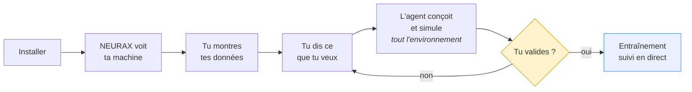
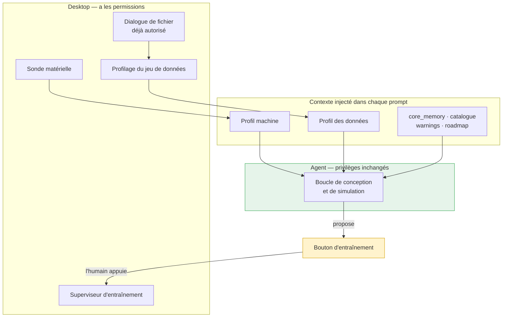
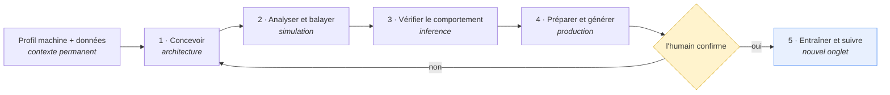
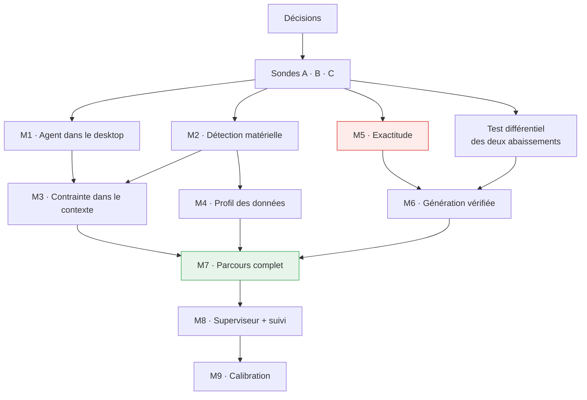

# NEURAX — l'agent conçoit pour ta machine, sur tes données

> Note d'intention et plan d'exécution.
>
> Cette version remplace la précédente, qui organisait la vision autour du
> pipeline analytique avec l'agent comme une entrée parmi d'autres. La bonne
> architecture met **l'agent au centre** : il connaît la machine, il connaît les
> données, il conçoit sous contrainte, il simule dans les espaces qui existent
> déjà, puis il propose l'entraînement — que l'humain lance.
>
> Écrit contre le code. Chaque état « existe / manque » a été relevé dans le
> dépôt.

---

## Table des matières

1. [La vision](#1-la-vision)
2. [Ce que le code dit déjà](#2-ce-que-le-code-dit-déjà)
3. [Le principe d'architecture](#3-le-principe-darchitecture)
4. [Les cinq changements de fond](#4-les-cinq-changements-de-fond)
5. [Décisions à prendre avant de coder](#5-décisions-à-prendre-avant-de-coder)
6. [Trois sondes de falsification](#6-trois-sondes-de-falsification)
7. [Le plan, jalon par jalon](#7-le-plan-jalon-par-jalon)
8. [Le graphe de dépendances](#8-le-graphe-de-dépendances)
9. [Registre de risques](#9-registre-de-risques)
10. [Ce qu'il ne faut pas faire](#10-ce-quil-ne-faut-pas-faire)
11. [La ligne de périmètre](#11-la-ligne-de-périmètre)

---

## 1. La vision

Tu installes NEURAX. Il regarde ta machine et te dit ce qu'il voit, sur le
canevas. Tu lui montres où sont tes données. Tu dis à l'agent ce que tu veux.

Il conçoit **pour ta carte et pour tes données** — pas un modèle générique qu'on
rétrécira ensuite. Il analyse, il balaie les configurations, il vérifie le
comportement à l'inférence, il prépare la production. **Il traverse tout
l'environnement.**

Puis il te propose d'entraîner. Tu appuies. Et tu suis l'entraînement en temps
réel, dans le studio.



---

## 2. Ce que le code dit déjà

Trois relevés qui déterminent tout le plan.

### 2.1 L'environnement complet existe — il manque un onglet

Le studio a **cinq espaces de travail**, et l'agent sait déjà naviguer entre eux
(`navigate_to`, accordé dans trois modes sur quatre) :

```
architecture · simulation · production · inference · timemachine
```

*« L'agent conçoit et simule complètement, puis passe à l'entraînement »* ne
demande donc pas de bâtir un environnement. Ça demande de **faire marcher l'agent
à travers celui qui existe**, et d'ajouter une seule surface : le suivi
d'entraînement.

**Cinq espaces existants + un nouveau.**

### 2.2 L'agent connaît le catalogue du monde, pas la machine devant lui

Ses seuls outils matériels aujourd'hui :

| Outil | Ce qu'il donne |
|---|---|
| `get_hardware_list` | la liste des 26 GPU du **catalogue** |
| `set_hw_config` | écrire une configuration |

Aucune notion du GPU réellement présent. Et **zéro outil de jeu de données** —
seul `estimate_training_cost` s'en approche, et il prend un nombre de tokens en
paramètre.

### 2.3 Le patron d'injection de contexte existe déjà

Ceci est présent dans **chaque prompt** de l'agent, sans qu'il ait à le demander :

```
core_memory · plan_items · analysis_warnings · missing_mandatory_fields · catalogue
```

C'est le bon patron, et c'est là que le profil machine et le profil des données
doivent aller. La raison tient en une phrase : **une contrainte qu'il faut penser
à interroger est une contrainte qu'on oublie.**

---

## 3. Le principe d'architecture

Une seule règle, dont découle tout le reste.

> **Les privilèges de l'agent n'augmentent pas.**
>
> Il ne lit aucun fichier. Il ne lance aucun processus. Tout ce qui est nouveau
> vit dans le desktop et le service, et lui parvient comme **contexte**.



Conséquences directes :

- Le profilage des données se fait **en Rust, dans le service embarqué**, à partir
  d'un fichier que l'utilisateur a désigné par le dialogue déjà autorisé. L'agent
  reçoit un profil, jamais un chemin, jamais un contenu.
- Le lancement d'entraînement est une **action humaine**. L'agent produit un plan
  validé, un bouton apparaît, il ne l'appuie pas.
- La posture de sécurité du desktop — *« deliberately narrow »*, deux permissions
  non-core — ne bouge que pour le superviseur, et de façon délimitée.

---

## 4. Les cinq changements de fond

### 4.1 Concevoir *sous* contrainte, pas concevoir *puis* vérifier

| | Aujourd'hui | Visé |
|---|---|---|
| Boucle | construire → `check_budget` → corriger | la contrainte est dans le prompt **dès le pas zéro** |
| Posture | réactive | générative |
| Résultat | un design qu'il faut rétrécir | un design né aux bonnes dimensions |

Le prompt de conception devient :

> *24 Go de VRAM libre, 32 Go de RAM, RTX 4090. Jeu de données : 47 300 images
> 224×224, 10 classes, déséquilibrées (majoritaire 31 %). Conçois en
> conséquence.*

### 4.2 Le raisonnement de dimensionnement existe — il lui manque l'entrée

NEURAX émet déjà ceci :

```
[Hint · H008 · Configuration]
  Tokens-per-parameter ratio is 80.9 (1.00e10 tokens / 1.24e8 params);
  the compute-optimal ratio from Chinchilla scaling laws (Hoffmann et al. 2022)
  is ~20.
```

C'est aujourd'hui un **constat après coup**. Avec un profil de données réel, ça
devient un **pilote de conception** : l'agent connaît le volume, il en déduit la
taille de modèle défendable, il conçoit à cette taille.

Le raisonnement est écrit, référence scientifique comprise. Il lui manque une
entrée.

### 4.3 Le profil de données remplit ce que l'utilisateur remplit à la main

`numClasses`, `inChannels`, `imgHeight`, `imgWidth`, la famille, la longueur de
séquence : ce sont précisément les champs de `MANDATORY_FIELDS`. Un profil réel
les déduit — donc **`missing_mandatory_fields` se vide de lui-même**.

### 4.4 La feuille de route devient le parcours produit

`plan_items` et `advance_plan_step` existent, et `done` est **refusé** tant qu'une
étape n'est pas cochée. Ce mécanisme générique devient le workflow :



### 4.5 Un cinquième mode

Quatre modes aujourd'hui, et les grants sont la vraie frontière du système.
« Conçois-moi un transformer pour comprendre » et « construis un modèle sur mes
données et entraîne-le » ne méritent pas les mêmes droits.

Un mode `build` avec son propre grant, incluant l'accès au profil de données et
aux outils de balayage. `creation` reste ce qu'il est.

---

## 5. Décisions à prendre avant de coder

Elles ne coûtent que de la réflexion et conditionnent tout le reste.

| Décision | Options | Recommandation |
|---|---|---|
| **Permissions du desktop** | garder l'étroitesse · élargir globalement · n'autoriser que ce que l'utilisateur a désigné | La troisième — c'est la discipline qu'`AuthorizedPaths` applique déjà à l'écriture |
| **Qui lance l'entraînement** | l'agent · l'humain · l'agent avec confirmation | **L'humain.** L'agent propose, un bouton apparaît |
| **Où vit le profilage des données** | agent (Python) · service (Rust) | **Service Rust** — les privilèges de l'agent restent inchangés |
| **Mode dédié ou extension** | étendre `creation` · cinquième mode | Cinquième mode `build` |
| **Adaptation en cours d'entraînement** | jamais · proposée · appliquée et journalisée | Proposée, jamais appliquée seule |

---

## 6. Trois sondes de falsification

Avant d'engager des mois, une semaine et demie pour savoir si la thèse tient.

| Sonde | Question | Durée | Ce qu'on apprend |
|---|---|---|---|
| **A · Génération** | Un modèle généré depuis `ModelConfig`, instancié, a-t-il le nombre de paramètres prédit ? | 2 j | Si l'écart est < 1 %, toute la boucle de vérification tient. **Mesure aussi la dette d'exactitude, famille par famille** |
| **B · Matériel** | La détection couvre-t-elle CUDA, Metal, ROCm sur les 3 OS ? | 3 j | Le risque n'est pas de lire une valeur, c'est la couverture |
| **C · Supervision** | Peut-on lancer, suivre et arrêter proprement un processus Python depuis Rust/Tauri ? | 2 j | Le risque est dans les permissions et l'arrêt propre, pas le lancement |

La sonde A est celle à la plus forte information : elle valide la thèse *et*
chiffre la dette en deux jours.

---

## 7. Le plan, jalon par jalon

Un jalon sans chiffre de sortie ne se termine jamais.

### M1 · L'agent dans le paquet desktop
**Pourquoi d'abord** — toute cette vision passe par l'agent, et il est absent du
produit installé : `neurax-desktop` n'a aucune référence au port 8099.
**Terminé quand** — le copilote répond dans un build fraîchement installé, sans
rien lancer à la main.
**Livre** — la conception assistée existe enfin chez le client.

### M2 · Détection matérielle et affichage sur le canevas
**Terminé quand** — détection réussie sur les 3 plateformes ; un GPU inconnu est
**déclaré** et non silencieusement générique ; le profil est visible en
permanence dans le studio.
**Livre** — *« NEURAX a vu ma carte »*. Les prédictions portent enfin sur le vrai
matériel.

### M3 · Injection du profil machine + conception sous contrainte
**Terminé quand** — le profil rejoint `core_memory` dans chaque prompt, et
**l'agent produit du premier coup un design qui tient dans la VRAM libre dans au
moins 80 % des runs** sur un jeu de demandes de référence.
**Livre** — l'agent conçoit pour la machine, il ne rétrécit plus après coup.

*C'est le jalon le plus mesurable du plan, et le plus révélateur : le taux de
réussite au premier essai dit tout de la qualité de la contrainte.*

### M4 · Profil du jeu de données
**Terminé quand** — profil produit pour les 3 formats les plus courants ; rien du
contenu ne quitte la machine ; **`missing_mandatory_fields` se vide sans
intervention** sur un jeu de données réel.
**Livre** — le modèle est personnalisé aux données, pas seulement à la machine.

### M5 · Exactitude — le verrou
**Terminé quand** — les 106 templates à moins de 10 % de leur taille publiée là où
elle existe. *Aujourd'hui : 11 templates de diffusion à **0,4 %**.*
**Pourquoi c'est un verrou** — prédire faux est embarrassant ; **produire un
modèle faux est un produit cassé**. Cette direction ne contourne pas la dette
d'exactitude, elle la rend bloquante.

### M6 · Génération depuis `ModelConfig` et boucle de vérification
**Terminé quand** — N des 61 types **génèrent, s'instancient, et concordent à
1 %** — les trois, pas seulement le premier.
**Livre** — l'analyse devient falsifiable par exécution, **sans GPU ni données**.

### M7 · Le parcours complet de l'agent
**Terminé quand** — la roadmap de l'agent traverse les 5 espaces, et `done` reste
refusé tant que la simulation n'a pas eu lieu.
**Livre** — *« l'agent conçoit et simule complètement »*, littéralement.

**À ce stade le produit est vendable**, sans entraînement : conception assistée,
chiffrage sur la vraie machine, personnalisation aux données, simulation
complète, code généré et vérifié.

### M8 · Superviseur et onglet d'entraînement
**Terminé quand** — un entraînement démarre sur confirmation humaine, se suit en
temps réel (perte, débit, VRAM, température), s'arrête proprement.
**Livre** — l'environnement complet.

### M9 · Prédit contre observé
**Terminé quand** — l'écart est enregistré par métrique ; l'efficacité matérielle
s'ajuste ; **un écart structurel produit un rapport de défaut, pas une
correction**.

> **Règle de sûreté, non négociable.** La calibration ajuste l'efficacité du
> matériel. Jamais les formules structurelles. Sinon elle apprendra un facteur
> ×300 000 pour la diffusion et masquera `vae_encoder` qui rend 108 paramètres :
> les chiffres deviendront justes, la formule restera cassée, et la première
> architecture inhabituelle fera s'effondrer la correction.
>
> Un nombre de paramètres est un fait *sur le modèle* : il se corrige dans la
> formule. Les TFLOPS atteints sont un fait *sur la machine* : ils s'apprennent.

---

## 8. Le graphe de dépendances

Ce n'est pas une file : quatre jalons sont parallèles.



### La dette à traiter en parallèle

**Deux abaissements clients divergent d'un facteur 10 000** — le même design donne
2 442 paramètres depuis le canevas et 25 865 098 depuis l'agent. Mesuré :
`compileToNeuraxIR` fait ~1 266 lignes, `spec_to_topology` 191. Ce n'est pas un
portage, c'est une re-dérivation simplifiée.

| Horizon | Action | Coût |
|---|---|---|
| **Maintenant** | Un test différentiel qui échoue en CI quand les deux divergent | 1 jour |
| **Plus tard** | Abaissement unique en Rust, les clients envoient le design | semaines |

Atténuer d'abord, réparer structurellement ensuite. Le test différentiel chiffre
la dette au passage.

---

## 9. Registre de risques

| Risque | Probabilité | Atténuation |
|---|---|---|
| La dette d'exactitude déborde la diffusion | moyenne | Sonde A la mesure en 2 jours, avant tout engagement |
| L'agent conçoit mal sous contrainte | **élevée** | M3 a un critère chiffré (80 % au premier essai) ; si le taux est bas, c'est le prompt qu'il faut retravailler, pas la suite du plan |
| La calibration masque des bugs | **élevée si non cadrée** | Règle de M9, appliquée dès la conception — pas rétrofitée |
| Glissement vers plateforme d'entraînement | **élevée** | La ligne de périmètre relue à chaque jalon, comme critère de sortie |
| Les 11 types non générables sont les plus utiles | moyenne | Les lister dès la sonde A ; si ce sont des blocs de diffusion, M5 et M6 fusionnent |
| Supervision cassée sous Windows | moyenne | Sonde C sur les 3 OS |
| Permissions élargies « en attendant » | moyenne | Décision 1 tranchée avant la première ligne de M8 |

---

## 10. Ce qu'il ne faut pas faire

**Commencer par l'onglet d'entraînement.** C'est la partie visible et
gratifiante. C'est aussi celle qui dépend de tout le reste — et la construire tôt
revient à superviser l'entraînement d'un modèle mal dimensionné.

**Donner à l'agent un outil `start_training`.** `MODE_TOOL_GRANTS` est un système
de moindre privilège appliqué deux fois. Un outil qui démarre un processus de
plusieurs heures n'est pas de la même nature qu'`add_node`.

**Donner à l'agent un accès disque.** Le profilage vit dans le service. L'agent
reçoit un profil, jamais un chemin.

**Traiter M5 comme de la maintenance.** C'est un jalon produit. Tant qu'il n'est
pas franchi, tout ce qui est en aval amplifie une erreur au lieu de la corriger.

---

## 11. La ligne de périmètre

| NEURAX fait | NEURAX ne fait pas |
|---|---|
| Voir la machine et le dire | Gérer un catalogue de jeux de données |
| Concevoir pour cette machine et ces données | Orchestrer du multi-nœud |
| Simuler complètement avant d'exécuter | Comparer des dizaines de runs |
| Générer un modèle instanciable et vérifié | Servir des modèles en production |
| Lancer et suivre **un** entraînement local | Files, priorités, multi-utilisateurs |
| Comparer prédiction et réalité | Régler automatiquement les hyperparamètres |

**Poste de conception et d'exécution locale. Pas plateforme d'entraînement.**

Le client repart avec un modèle conçu pour sa machine, dimensionné pour ses
données, vérifié — et il l'entraîne, ici ou ailleurs.

---

## En une phrase

> **L'agent connaît ta machine et tes données avant d'écrire la première couche.**

---

*Note d'intention et plan de travail — à tenir à jour, pas à archiver. Les états
« existe / manque » ont été relevés dans le code ; les blocages chiffrés ont été
mesurés, pas estimés.*
