# NEURAX Desktop — poste de conception et d'exécution

> Note d'intention. Ce document approfondit une direction produit : faire passer
> NEURAX d'un compilateur analytique à un environnement complet de conception,
> de planification, d'exécution et d'observation d'un entraînement, **sur la
> machine du client**.
>
> Il est écrit contre le code existant. Chaque brique indique ce qui est déjà là,
> ce qui manque, et ce qui bloque — mesuré, pas supposé. Il contient aussi une
> section de tensions non résolues : une note d'intention qui ne dit que le bien
> qu'elle pense d'elle-même n'aide personne à décider.

---

## Table des matières

1. [Le point de départ](#1-le-point-de-départ)
2. [La vision, et le parcours](#2-la-vision-et-le-parcours)
3. [L'axiome à renégocier](#3-laxiome-à-renégocier)
4. [Découverte matérielle](#4-découverte-matérielle)
5. [Analyse du jeu de données](#5-analyse-du-jeu-de-données)
6. [Modèle d'adéquation](#6-modèle-dadéquation)
7. [Training IR](#7-training-ir)
8. [Génération et exécution](#8-génération-et-exécution)
9. [Observabilité](#9-observabilité)
10. [La boucle de calibration](#10-la-boucle-de-calibration)
11. [Le dossier d'expérience](#11-le-dossier-dexpérience)
12. [Architecture cible](#12-architecture-cible)
13. [Tensions à trancher](#13-tensions-à-trancher)
14. [Ce qui bloque aujourd'hui](#14-ce-qui-bloque-aujourdhui)
15. [Séquencement](#15-séquencement)
16. [La ligne de périmètre](#16-la-ligne-de-périmètre)

---

## 1. Le point de départ

Ce que NEURAX est aujourd'hui, précisément — c'est la base sur laquelle tout le
reste s'ajoute.

| Capacité | État réel |
|---|---|
| Compilation analytique | ✅ 11 phases, ~25 000 lignes, une analyse sous la milliseconde |
| Base matérielle | ✅ 26 GPU, TFLOPS par précision, bande passante, TDP, calibration d'efficacité |
| Tout en local | ✅ le desktop embarque `neurax-service` **dans son propre processus**, sur une socket loopback |
| Persistance locale | ✅ `persistence.rs`, projets sur disque |
| Génération de code exécutable | ⚠️ **50 types sur 61**, en TypeScript, depuis le canevas |
| Export ONNX | ⚠️ graphe et formes réels, **tenseurs à zéro** |
| Conception assistée | ⚠️ l'agent existe, **le paquet desktop ne le lance jamais** |
| Détection matérielle | ❌ **aucune** — l'utilisateur choisit parmi 26 GPU |
| Analyse de jeu de données | ❌ inexistante — `dataset_size` est un simple scalaire lu par la phase Coût |
| Exécution d'entraînement | ❌ inexistante, et exclue par construction |

La vision n'est donc pas un pivot. C'est **l'achèvement d'un chemin déjà à moitié
construit**, plus deux briques réellement nouvelles : le jeu de données et
l'exécution.

---

## 2. La vision, et le parcours

> NEURAX comprend le modèle, comprend les données, comprend la machine —
> **avant** de lancer quoi que ce soit. Puis il génère, exécute, observe, et
> apprend de l'écart entre ce qu'il avait prédit et ce qui s'est passé.

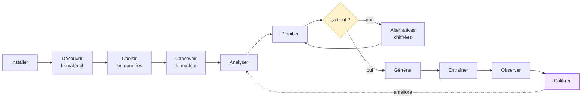

Le renversement tient en une phrase : **aujourd'hui on découvre la contrainte
mémoire six heures après le lancement ; ici on la connaît avant de lancer**, et
NEURAX propose les alternatives chiffrées plutôt que de constater l'échec.

---

## 3. L'axiome à renégocier

Il faut le dire franchement, parce que c'est écrit dans le code :

> `neurax-core/src/sweep.rs` — *« NEURAX never runs a model »*

Cette phrase n'est pas un commentaire décoratif. C'est **la propriété qui donne à
NEURAX sa vitesse** : pas d'exécution ⇒ une analyse coûte moins d'une
milliseconde ⇒ balayer des milliers de configurations devient possible ⇒ le
`sweep` existe.

La vision propose d'exécuter un entraînement. Ce n'est pas une extension mineure,
c'est l'inversion d'un axiome fondateur. **Il faut le résoudre par
l'architecture, pas par l'omission.**

### La résolution

Le **compilateur** continue de ne jamais exécuter de modèle. Le **runtime** est un
composant séparé, que le compilateur planifie puis observe, mais dont il ne
dépend jamais.

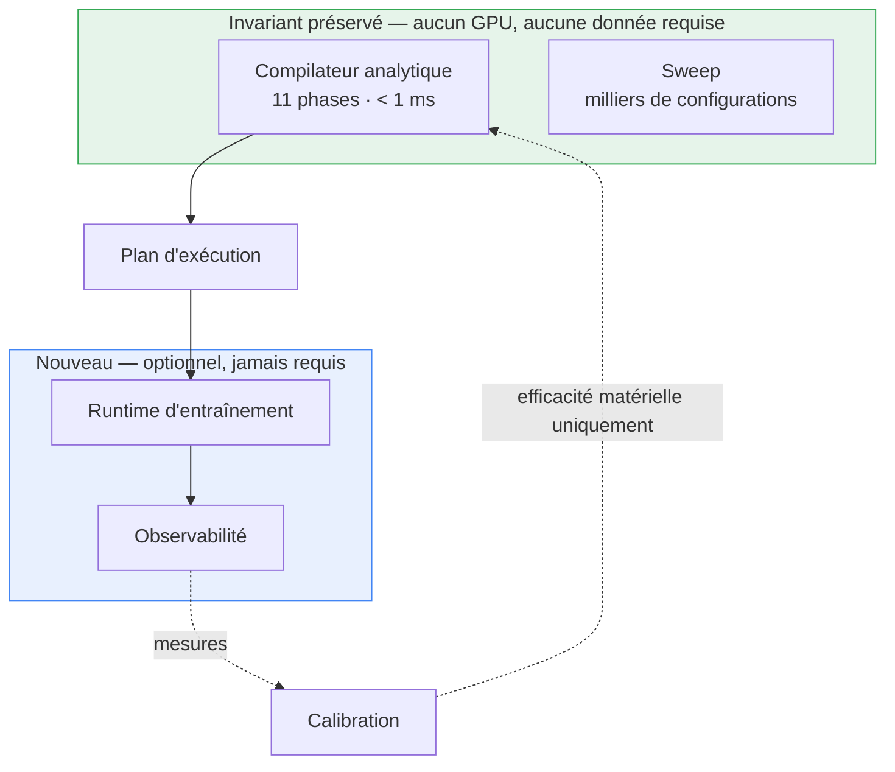

**Règle non négociable :** l'analyse doit rester exécutable sans GPU, sans jeu de
données, et sans runtime installé. Le jour où analyser exige d'entraîner, NEURAX
a perdu ce qui le distingue.

---

## 4. Découverte matérielle

### Rôle

Remplacer *« le matériel que l'utilisateur déclare »* par *« le matériel que
l'utilisateur possède »*.

### Ce qui existe

`neurax-hardware-db` connaît 26 GPU avec leurs caractéristiques réelles, et la
phase 8 applique une calibration d'efficacité par carte. **Ce qui manque n'est pas
le savoir sur le matériel — c'est le regard sur la machine.** Zéro fichier de
détection dans tout le dépôt.

### Ce qu'il faut

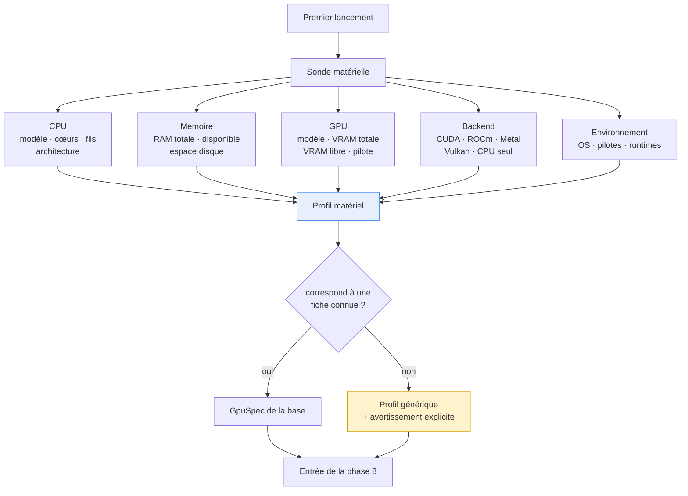

### Deux subtilités qui comptent

**La VRAM disponible n'est pas la VRAM de la carte.** Le compositeur du bureau, le
navigateur, les autres processus en consomment — et NEURAX Desktop lui-même est
une application Tauri avec une webview. Un plan qui vise 100 % de la VRAM
nominale échouera sur une machine réelle. La marge de sûreté doit compter
**l'empreinte de l'outil qui la calcule**.

**Un matériel inconnu doit être visible.** `get_gpu_or_fallback` retombe
aujourd'hui sur un profil générique sans que le rapport le dise. Acceptable pour
une prédiction ; inacceptable pour un plan d'exécution. Si NEURAX ne reconnaît
pas la carte, il doit le déclarer et non chiffrer en silence.

---

## 5. Analyse du jeu de données

### Rôle

Comprendre la charge réelle qui sera présentée au modèle — c'est elle qui
détermine la taille de batch atteignable, le nombre de pas, la durée.

### Ce qui existe

Rien. `data.dataset_size` est un scalaire unique, lu par la seule phase Coût pour
estimer une durée. Aucune lecture de fichier, aucune statistique, aucune notion
de forme d'échantillon.

### Ce qu'il faut

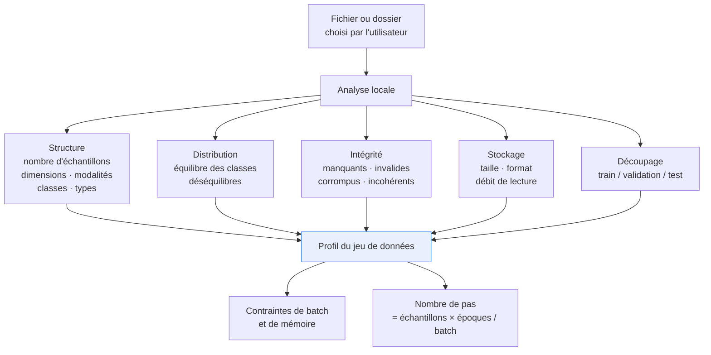

### La règle de confiance

C'est la brique qui demande le plus au client : lire ses données. NEURAX affiche
aujourd'hui *« No project ever uploaded anywhere »*. Lire un jeu de données est
un cran au-dessus, même en local. La règle doit être écrite dans le produit, pas
seulement pensée :

> **NEURAX lit la structure et les statistiques d'un jeu de données. Jamais son
> contenu. Rien n'en sort de la machine. L'empreinte enregistrée dans le dossier
> d'expérience est un condensat, jamais un échantillon.**

---

## 6. Modèle d'adéquation

### Rôle

Répondre à *« est-ce que ça tient ? »* — et, quand la réponse est non, **dire
pourquoi et proposer des alternatives chiffrées**.

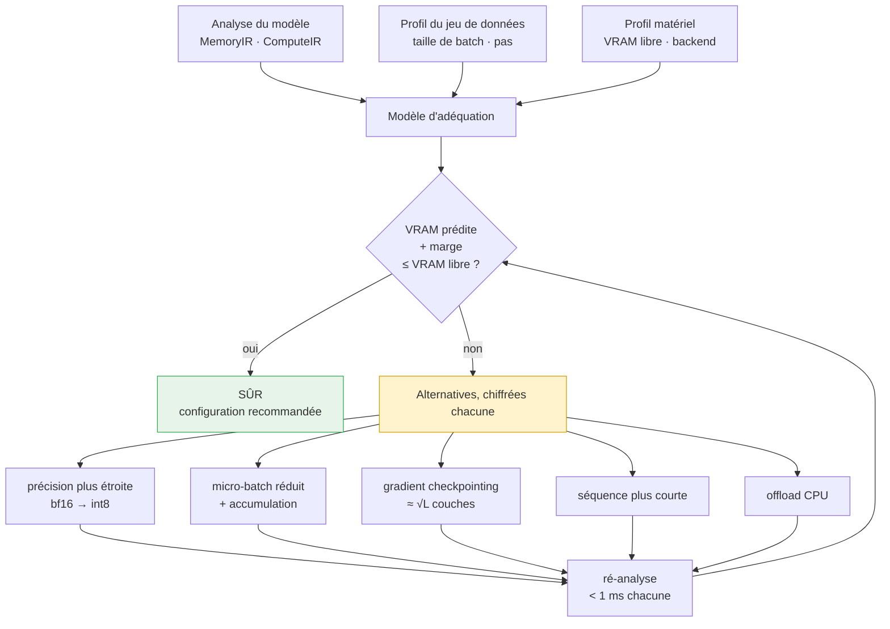

**C'est ici que le `sweep` existant devient un moteur de produit.** Il balaie déjà
`batch_size × zero_stage × gpu_count × precision` en réutilisant `run_analysis`
comme évaluateur. Le modèle d'adéquation, c'est le sweep avec une contrainte dure
(la VRAM libre détectée) et une présentation orientée décision.

Forme visée d'un verdict :

```
VRAM au pic prédite   18,7 Go
VRAM disponible       24,0 Go   (23,1 Go libres — 0,9 Go pris par le bureau)
Marge de sûreté        4,4 Go
Statut                SÛR
Configuration         bf16 · batch 16 · pas d'accumulation
```

Et quand ça ne tient pas, la même précision dans le refus : non pas *« mémoire
insuffisante »*, mais *« 41 % de la mémoire part dans les états d'optimiseur ;
passer AdamW en 8 bits libère 6,2 Go et fait tenir »*.

---

## 7. Training IR

### Rôle

Le contrat unique entre la planification et l'exécution — ce que `ModelConfig`
est déjà entre l'extérieur et le compilateur.

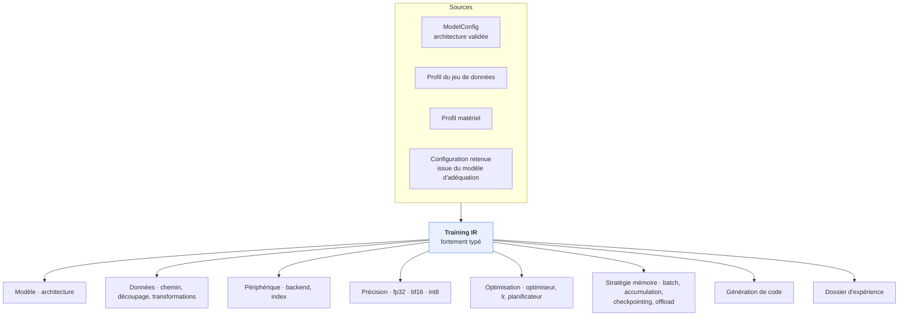

**Discipline à tenir :** le Training IR doit être la **seule** entrée du
générateur. C'est ce qu'OpSpec a apporté au niveau de l'opération — une
définition, pas trois — appliqué au niveau de l'exécution. Sans cette règle, on
reproduit exactement le défaut qui a coûté le plus cher au projet : deux
représentations du même objet qui divergent en silence.

---

## 8. Génération et exécution

### La correction que j'apporte à la vision initiale

L'idée d'origine place **Rust comme cible de génération de première classe**. Je
propose l'inverse, et pour des raisons mesurables.

| Cible | Couverture réelle | Verdict |
|---|---|---|
| **PyTorch** | **50 des 61 types**, déjà écrits, déjà adossés aux formules de `neurax-formulas` | **cible primaire** |
| Rust natif (Candle, Burn) | couverture d'opérateurs très inférieure ; diffusion, MoE et SSM largement absents | inatteignable à court terme |
| Rust via `tch-rs` | c'est PyTorch avec une façade Rust — on paie le pont sans gagner d'opérateurs | sans intérêt ici |

Écrire un runtime d'entraînement en Rust, c'est réécrire un cadre d'apprentissage
profond. Ce n'est pas le produit.

### L'architecture que je propose

**Rust supervise, Python entraîne.**

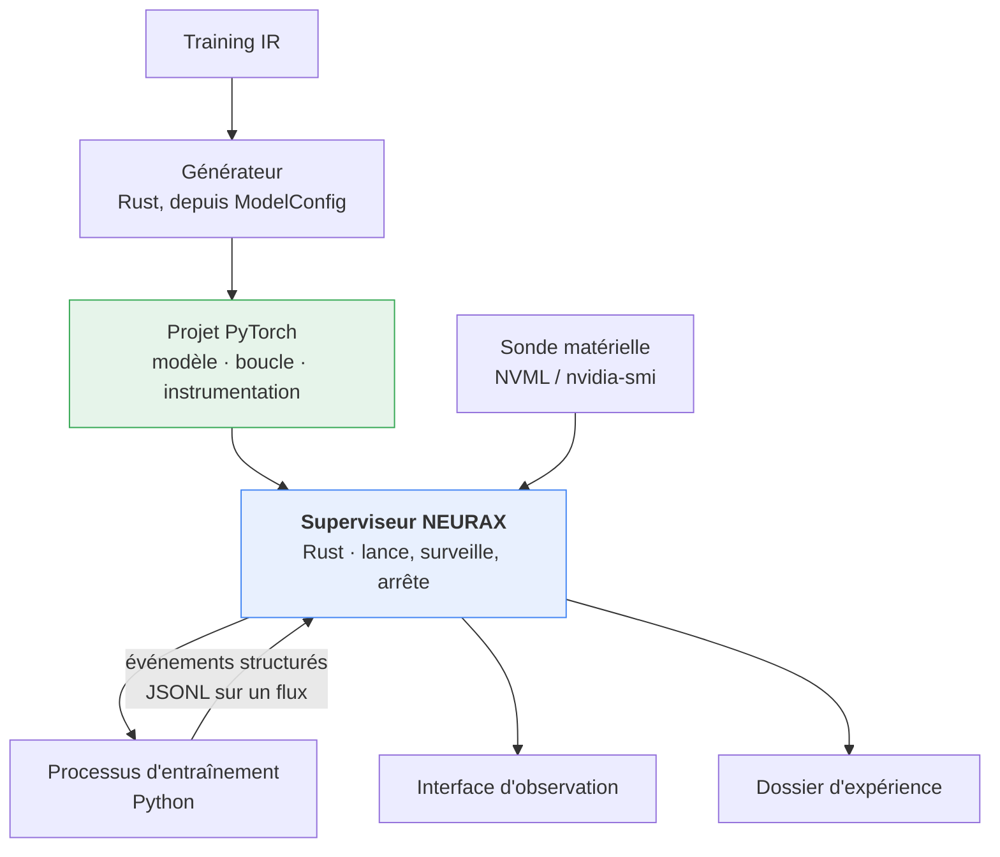

Le superviseur ne connaît rien à l'apprentissage. Il lance un processus, lit un
flux d'événements structurés, interroge le pilote pour les métriques matérielles,
et rend tout ça à l'interface. C'est un rôle petit, testable, et écrit dans le
langage qui convient.

Le code généré porte son propre instrumentation : à chaque pas, il émet une ligne
JSON — pas, perte, débit, VRAM allouée. C'est le même motif que le streaming SSE
que NEURAX pratique déjà.

### Ce que la génération apporte au-delà de l'exécution

Un effet de bord majeur, développé au §10 : **on ne peut pas générer un encodeur
VAE exécutable à 108 paramètres**. La génération est un test de totalité que
nulle suite de tests ne fournit — elle force chaque formule à être complète, parce
qu'une formule incomplète produit du code qui ne correspond pas à sa description.

---

## 9. Observabilité

### Rôle

Faire de NEURAX Desktop la **surface de contrôle** de l'entraînement, et non un
lanceur qui rend la main à un terminal.

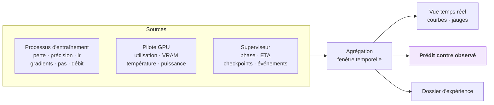

La vue *prédit contre observé* est ce qui distingue cette interface de n'importe
quel tableau de bord d'entraînement. Elle n'affiche pas seulement la VRAM
consommée : elle affiche **la VRAM consommée à côté de la VRAM annoncée**, et
l'écart.

---

## 10. La boucle de calibration

C'est l'idée la plus forte de la vision, et celle qui demande le plus de
précaution.

### Le principe

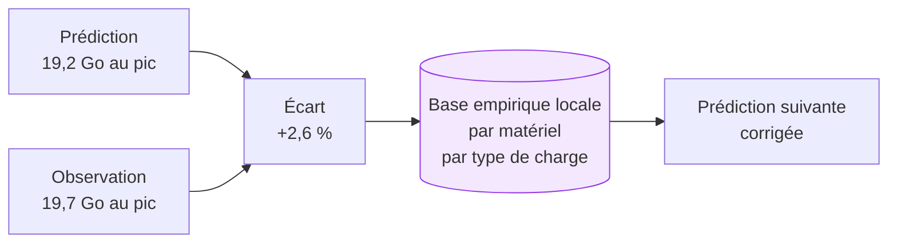

### Ce que ça change épistémologiquement

Aujourd'hui la vérité de référence de NEURAX, ce sont **les tailles publiées** —
des nombres rapportés par des humains dans des articles. `published_model_accuracy.rs`
compare à sept d'entre eux.

Avec la boucle, la référence devient **le comportement observé sur la machine du
client**. On passe de *« nous sommes d'accord avec la littérature »* à *« nous
sommes d'accord avec votre carte »*. C'est une revendication plus forte, et un
avantage qui se creuse : chaque entraînement lancé améliore les prédictions pour
cette configuration.

### La règle de sûreté — le point le plus important de ce document

Une boucle de calibration mal cadrée **rend le système exact et faux**.

Concrètement : `vae_encoder` rend aujourd'hui 108 paramètres au lieu d'environ
34 millions. Si la calibration apprend librement, elle finira par découvrir qu'il
faut multiplier par 300 000 les prédictions mémoire des modèles de diffusion. Les
chiffres deviendront justes. **La formule restera cassée**, masquée par un facteur
correctif — et la première architecture de diffusion inhabituelle fera s'effondrer
la correction sans que personne comprenne pourquoi.

D'où la règle :

> **La calibration ajuste l'efficacité du matériel. Jamais les formules
> structurelles.**
>
> Le nombre de paramètres d'un modèle est un fait **sur le modèle** : il se
> corrige dans la formule, pas dans un coefficient. Les TFLOPS réellement
> atteints sont un fait **sur la machine** : ils s'apprennent.

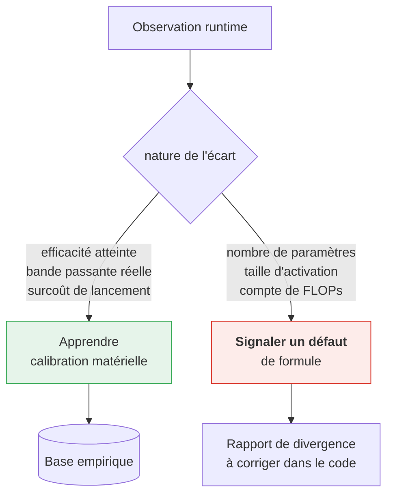

Un écart structurel n'est pas une donnée à absorber : **c'est un bug à remonter**.
La boucle devient alors un détecteur de défauts du compilateur, ce qui est bien
plus précieux qu'un correcteur d'erreurs.

---

## 11. Le dossier d'expérience

Chaque exécution produit un dossier reproductible et auditable.

| Contenu | Rôle |
|---|---|
| Empreinte du modèle | condensat du `ModelConfig` |
| Empreinte du jeu de données | condensat, **jamais d'échantillon** |
| Empreinte matérielle | profil détecté au moment de l'exécution |
| Environnement logiciel | OS, pilotes, versions de runtime |
| Training IR | la configuration complète, telle qu'exécutée |
| Rapport analytique | ce que NEURAX avait prédit |
| Code généré | ce qui a réellement tourné |
| Métriques d'entraînement et matérielles | ce qui s'est passé |
| Journaux et checkpoints | les artefacts |
| Statut de vérification | quels contrôles ont été passés |
| Prédit contre observé | l'écart, par métrique |

C'est aussi la brique qui rend la calibration honnête : sans empreinte matérielle
et logicielle, une correction apprise sur une machine serait appliquée à une
autre.

---

## 12. Architecture cible

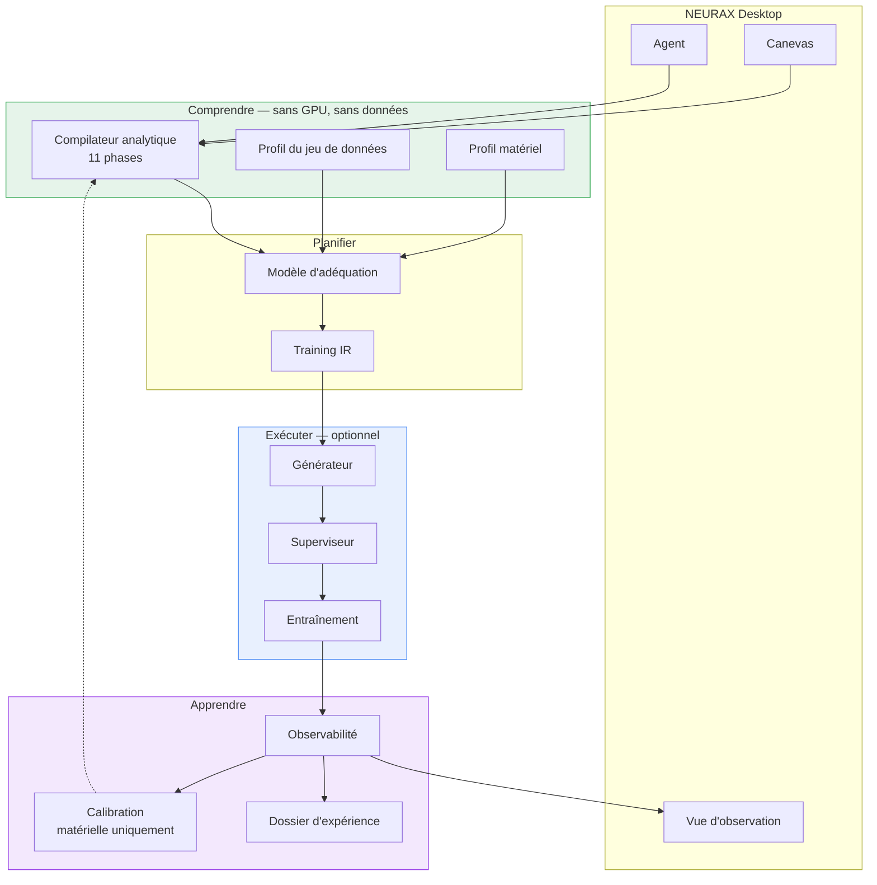

---

## 13. Tensions à trancher

Cinq points où la vision se heurte à quelque chose, et qui demandent une décision
explicite plutôt qu'un contournement.

### 13.1 La posture de sécurité du desktop s'inverse

Le fichier de capacités de `neurax-desktop` dit, mot pour mot :

> *Deliberately narrow: file access happens only through a dialog the user drove.*

Deux permissions seulement : `dialog` et `opener`. Ni système de fichiers libre,
ni shell, ni lancement de processus.

Lancer un entraînement exige de démarrer un processus. Lire un jeu de données
exige un accès disque au-delà d'un fichier choisi. **C'est un renversement d'une
posture documentée comme délibérée**, et il doit être assumé : quelles permissions
exactement, accordées à quel moment, révocables comment.

Piste : n'accorder l'accès qu'aux chemins que l'utilisateur a explicitement
désignés — la même discipline que `AuthorizedPaths` applique déjà à l'écriture de
fichiers, où pointer un fichier n'autorise pas à l'écraser.

### 13.2 Adaptation dynamique contre reproductibilité

Le §10 de la vision d'origine propose une adaptation en cours d'exécution :
réduire le micro-batch si la pression VRAM devient critique.

Mais un entraînement dont la configuration change en route **n'est plus celui que
le dossier d'expérience décrit**, et la comparaison prédit/observé perd son sens :
on compare une prédiction faite pour une configuration à l'observation d'une
autre.

Trois options, à trancher :

| Option | Effet |
|---|---|
| Pas d'adaptation | Reproductibilité parfaite, échecs plus fréquents |
| Adaptation proposée, jamais appliquée | L'utilisateur arrête, ajuste, relance — traçable |
| Adaptation appliquée, enregistrée comme un événement daté | La comparaison devient segmentée par période |

Je recommanderais la deuxième au départ. La troisième est défendable mais exige
que toute la chaîne d'observation devienne consciente des segments.

### 13.3 La barre de justesse monte d'un cran

Prédire faux est embarrassant. **Produire un modèle faux est un produit cassé.**

Tant que `vae_encoder` rend 108 paramètres, un planificateur d'entraînement
annoncerait qu'un Stable Diffusion tient dans 1 Go. Cette direction ne contourne
pas la dette d'exactitude : elle la rend bloquante. C'est un bon signe — une
direction produit qui force à réparer ce qui était déjà faux est une bonne
direction — mais l'ordre s'impose de lui-même.

### 13.4 Deux compilateurs clients qui divergent

Le même design donne aujourd'hui **2 442 paramètres** depuis le canevas et
**25 865 098** depuis l'agent. Dans un poste de conception, cela devient : l'agent
conçoit une chose, le canevas en produit une autre, et le plan d'exécution ne sait
pas laquelle.

Le Training IR ne résout ce problème que s'il est alimenté par **un** abaissement.

### 13.5 Le glissement vers la plateforme d'entraînement

Le danger permanent. Données, checkpoints, orchestration multi-nœuds, suivi
d'expériences, comparaison de runs : chacun paraît un ajout naturel, et l'ensemble
constitue un autre produit — un dont NEURAX ne détient aucun avantage.

Le garde-fou est au §16.

---

## 14. Ce qui bloque aujourd'hui

Mesuré, par ordre de blocage.

| Blocage | Mesure | Impact sur la vision |
|---|---|---|
| **Le paquet desktop ne lance pas l'agent** | `neurax-desktop` n'a aucune référence au port 8099 | La conception assistée est absente du produit livré |
| **Formules de paramètres diffusion** | `vae_encoder` = 108 au lieu de ≈ 34 M ; SD v1 mesuré à 0,4 % de sa taille | Un plan d'exécution serait faux d'un facteur 500 sur une famille entière |
| **Deux abaissements clients divergents** | 2 442 contre 25 865 098 sur le même design | Le Training IR n'aurait pas de source unique |
| **11 types sur 61 non générables** | `SUPPORTED_TYPES` couvre 50 types | Un design peut échouer en `NotImplementedError` au milieu du fichier |
| **Aucune détection matérielle** | 0 fichier dans le dépôt | « sur ta machine » reste « sur la machine que tu déclares » |
| **Mémoire d'activation partielle dans OpSpec** | 6 types sur 60 la suivent réellement | La comparaison prédit/observé sur les activations ne vaut que pour six types |

---

## 15. Séquencement

Chaque phase livre une valeur autonome. Aucune ne dépend de la suivante pour être
utile.

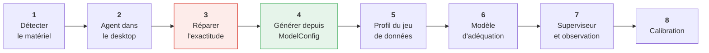

| Phase | Livre | Coût estimé |
|---|---|---|
| **1 · Détection matérielle** | *NEURAX a vu ma carte* — effet perçu immédiat, prédictions enfin sur le vrai matériel | jours |
| **2 · Agent dans le desktop** | La conception assistée existe enfin dans le produit installé | jours |
| **3 · Exactitude diffusion** | Les chiffres deviennent défendables sur les 8 familles | semaines |
| **4 · Génération depuis `ModelConfig`** | Un seul générateur ; l'analyse devient falsifiable par exécution, **sans GPU ni données** | semaines |
| **5 · Profil du jeu de données** | Le nombre de pas et la contrainte de batch deviennent réels | semaines |
| **6 · Modèle d'adéquation** | Le verdict « ça tient / voici les alternatives » | semaines |
| **7 · Superviseur et observation** | L'entraînement se lance et se suit depuis NEURAX | mois |
| **8 · Calibration** | La boucle se ferme ; NEURAX apprend de la machine | mois |

**La phase 4 mérite d'être soulignée** : générer le modèle et compter ses
paramètres réels ne demande ni GPU, ni jeu de données, ni une seconde
d'entraînement. C'est simultanément la vérification dont NEURAX a besoin et la
moitié du produit que le client vient chercher — et elle arrive bien avant la
partie coûteuse.

---

## 16. La ligne de périmètre

| NEURAX fait | NEURAX ne fait pas |
|---|---|
| Comprendre le modèle, les données, la machine | Gérer un catalogue de jeux de données |
| Chiffrer sur le matériel réellement présent | Orchestrer du multi-nœud |
| Planifier et valider une exécution | Comparer des dizaines de runs |
| Générer un modèle instanciable | Servir des modèles en production |
| Lancer et observer **un** entraînement local | Gérer des files, des priorités, des utilisateurs |
| Comparer prédiction et réalité | Régler automatiquement les hyperparamètres |

**Poste de conception et d'exécution locale. Pas plateforme d'entraînement.**

Le client repart avec un modèle **conçu, chiffré, vérifié, dimensionné pour sa
machine** — et il l'entraîne, ici ou ailleurs, avec ses outils.

---

## En une phrase

> **NEURAX comprend le modèle avant de le lancer.**

Il comprend le modèle, comprend les données, comprend le matériel, prédit les
ressources, valide le plan, génère le code, exécute l'entraînement, observe le
comportement réel, et corrige sa vision du matériel — jamais ses formules — à
partir de l'écart.

---

*Note d'intention, à confronter au réel avant tout engagement. Les états « ce qui
existe » ont été relevés dans le code du dépôt ; les blocages du §14 ont été
mesurés, pas estimés.*
