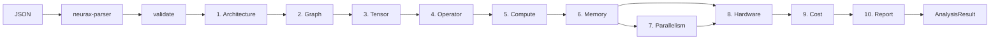

# neurax-core

**The NEURAX unified analysis engine — one function call from JSON to a full analytical report.**

Part of [NEURAX](https://github.com/rustnew/NEURAX), the analytical compiler for neural network architectures. `neurax-core` orchestrates the entire pipeline — **parse → validate → 10-pass IR → report** — behind a tiny public API.

> **The vision:** `analyze_json(...)` is to neural architecture analysis what `cargo build` is to compilation. Point it at a model description, get back a complete, deterministic analytical report.

## What you get from one call

- **Compute**: total FLOPs, MACs, FLOPs per token, arithmetic intensity, complexity class
- **Memory**: parameters, activations, gradients, optimizer states, peak VRAM
- **Parallelism**: optimal strategy (DP / TP / PP / ZeRO), communication overhead
- **Hardware**: GPU utilization, throughput, latency, bottleneck analysis
- **Cost**: training time, $ cost, energy (kWh), CO₂ (kg)
- **Report**: full markdown + JSON report, phase timeline, diagnostics

## Installation

```toml
[dependencies]
neurax-core = { git = "https://github.com/rustnew/NEURAX", package = "neurax-core" }
```

## Quick start

```rust
use neurax_core::{analyze_json, validate_json, get_model_summary};

const MODEL_JSON: &str = r#"
{
  "schema_version": "1.0",
  "model": {
    "name": "tiny-gpt",
    "type": "transformer",
    "layers": [
      {
        "id": "attn_0",
        "layer_type": "attention",
        "input_shape": [128, 768],
        "output_shape": [128, 768],
        "params": { "num_heads": 12 }
      }
    ],
    "global_params": { "hidden_size": 768, "num_layers": 1 }
  },
  "training": { "batch_size": 32, "optimizer": "adamw", "precision": "bf16" },
  "hardware": {
    "gpus": [
      {
        "name": "A100-80GB",
        "count": 1,
        "memory_gb": 80,
        "tflops_fp16": 312,
        "tflops_fp32": 19.5,
        "memory_bandwidth_gb_s": 2039,
        "tensor_cores": true
      }
    ],
    "interconnect": "None",
    "interconnect_bandwidth_gb_s": 0
  }
}
"#;

// One call: parse → validate → 10-pass IR → report
let result = analyze_json(MODEL_JSON)?;

// Compute
println!("FLOPs: {:.2e}", result.compute.metrics.total_flops);

// Memory
println!("Peak VRAM: {:.2} GB", result.memory.metrics.peak_vram_bytes as f64 / 1e9);

// Hardware
println!("GPU utilization: {:.2}", result.hardware.metrics.gpu_utilization);

// Cost
println!("Training cost: ${:.2}", result.cost.metrics.training_cost_usd);

// The full markdown report
let markdown = neurax_ir::report::format::format_markdown(&result.report);
println!("{}", markdown);
```

## API overview

| Function | Description |
|----------|-------------|
| `analyze_json(json) -> Result<AnalysisResult, NeuraxError>` | Full analysis from JSON string |
| `analyze_file(path) -> Result<AnalysisResult, NeuraxError>` | Full analysis from a `.json` file |
| `validate_json(json) -> Result<ModelConfig, NeuraxError>` | Parse + validate only |
| `get_model_summary(config) -> ModelSummary` | Quick summary without full analysis |
| `run_analysis(config) -> Result<AnalysisResult, NeuraxError>` | Analysis from a parsed `ModelConfig` |
| `run_analysis_streaming(...)` | Streaming variant for large models |

### `AnalysisResult` — everything the pipeline produced

| Field | IR | Contents |
|-------|----|----------|
| `arch` | ArchitectureIR | Normalized model structure |
| `graph` | GraphIR | Dataflow graph, depth, ops |
| `tensor` | TensorIR | All tensors with shapes |
| `operator` | OperatorIR | Atomic operations |
| `compute` | ComputeIR | FLOPs, MACs, intensity |
| `memory` | MemoryIR | Memory breakdown, peak VRAM |
| `parallelism` | ParallelismIR | Optimal strategy |
| `hardware` | HardwareIR | Utilization, throughput, latency |
| `cost` | CostIR | Time, $, energy, CO₂ |
| `report` | ReportIR | Final report (markdown/JSON) |
| `dynamic` | DynamicResults | Dynamic analysis (M36–M55) |

## The pipeline under the hood



Passes 7 & 8 run concurrently (rayon), and the whole pipeline is deterministic.

## Ecosystem

| Crate | Role |
|-------|------|
| [`neurax-parser`](../neurax-parser) | JSON → validated `ModelConfig` |
| [`neurax-ir`](../neurax-ir) | The 10-pass IR pipeline |
| [`neurax-opspec`](../neurax-opspec) | One params+FLOPs definition per operation, consulted by `neurax-ir` |
| [`neurax-formulas`](../neurax-formulas) | Analytical FLOPs/memory formulas |
| [`neurax-hardware-db`](../neurax-hardware-db) | GPU/CPU/interconnect specs |
| **neurax-core** | **The unified engine (this crate)** |

These are workspace crates in this repository — use a path or git dependency
to reach any of them from outside a checkout.

## License

Proprietary — closed-source, commercial software. All rights reserved.